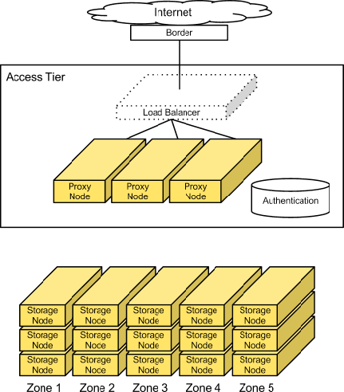
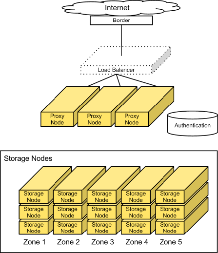

====================
Cluster architecture
====================

Access tier
~~~~~~~~~~~
Large-scale deployments segment off an access tier, which is considered
the Object Storage system's central hub. The access tier fields the
incoming API requests from clients and moves data in and out of the
system. This tier consists of front-end load balancers, ssl-terminators,
and authentication services. It runs the (distributed) brain of the
Object Storage system: the proxy server processes.

.. note::

   If you want to use OpenStack Identity API v3 for authentication, you
   have the following options available in ``/etc/swift/dispersion.conf``:
   ``auth_version``, ``user_domain_name``, ``project_domain_name``,
   and ``project_name``.

**Object Storage architecture**

Because access servers are collocated in their own tier, you can scale
out read/write access regardless of the storage capacity. For example,
if a cluster is on the public Internet, requires SSL termination, and
has a high demand for data access, you can provision many access
servers. However, if the cluster is on a private network and used
primarily for archival purposes, you need fewer access servers.

Since this is an HTTP addressable storage service, you may incorporate a
load balancer into the access tier.

Typically, the tier consists of a collection of 1U servers. These
machines use a moderate amount of RAM and are network I/O intensive.
Since these systems field each incoming API request, you should
provision them with two high-throughput (10GbE) interfaces - one for the
incoming front-end requests and the other for the back-end access to
the object storage nodes to put and fetch data.

Factors to consider
-------------------

For most publicly facing deployments as well as private deployments
available across a wide-reaching corporate network, you use SSL to
encrypt traffic to the client. SSL adds significant processing load to
establish sessions between clients, which is why you have to provision
more capacity in the access layer. SSL may not be required for private
deployments on trusted networks.

Storage nodes
~~~~~~~~~~~~~

In most configurations, each of the five zones should have an equal
amount of storage capacity. Storage nodes use a reasonable amount of
memory and CPU. Metadata needs to be readily available to return objects
quickly. The object stores run services not only to field incoming
requests from the access tier, but to also run replicators, auditors,
and reapers. You can provision storage nodes with single gigabit or
10 gigabit network interface depending on the expected workload and
desired performance, although it may be desirable to isolate replication
traffic with a second interface.

**Object Storage (swift)**

Currently, a 2 TB or 3 TB SATA disk delivers good performance for the
price. You can use desktop-grade drives if you have responsive remote
hands in the datacenter and enterprise-grade drives if you don't.

Factors to consider
-------------------

You should keep in mind the desired I/O performance for single-threaded
requests. This system does not use RAID, so a single disk handles each
request for an object. Disk performance impacts single-threaded response
rates.

To achieve apparent higher throughput, the object storage system is
designed to handle concurrent uploads/downloads. The network I/O
capacity (1GbE, bonded 1GbE pair, or 10GbE) should match your desired
concurrent throughput needs for reads and writes.
