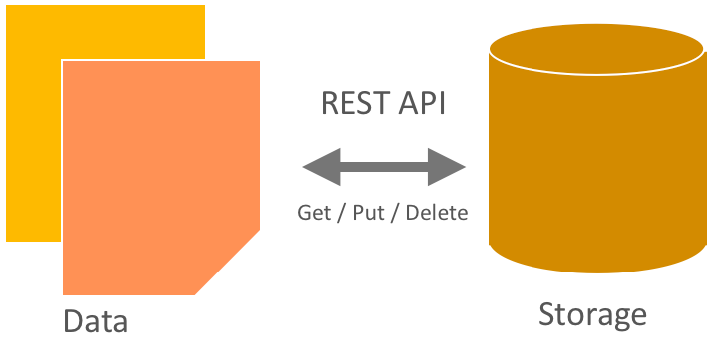

==============================
Object Storage characteristics
==============================

The key characteristics of Object Storage are that:

-  All objects stored in Object Storage have a URL.

-  "Storage Policies" may be used to define different levels of durability
   for objects stored in the cluster. These policies support not only
   complete replicas but also erasure-coded fragments.

-  All replicas or fragments for an object are stored in as-unique-as-possible
   zones to increase durability and availability.

-  All objects have their own metadata.

-  Developers interact with the object storage system through a RESTful
   HTTP API.

-  Object data can be located anywhere in the cluster.

-  The cluster scales by adding additional nodes without sacrificing
   performance, which allows a more cost-effective linear storage
   expansion than fork-lift upgrades.

-  Data does not have to be migrated to an entirely new storage system.

-  New nodes can be added to the cluster without downtime.

-  Failed nodes and disks can be swapped out without downtime.

-  It runs on industry-standard hardware, such as Dell, HP, and
   Supermicro.

.. _objectstorage-figure:

Object Storage (swift)

Developers can either write directly to the Swift API or use one of the
many client libraries that exist for all of the popular programming
languages, such as Java, Python, Ruby, and C#. Amazon S3 and RackSpace
Cloud Files users should be very familiar with Object Storage. Users new
to object storage systems will have to adjust to a different approach
and mindset than those required for a traditional filesystem.
