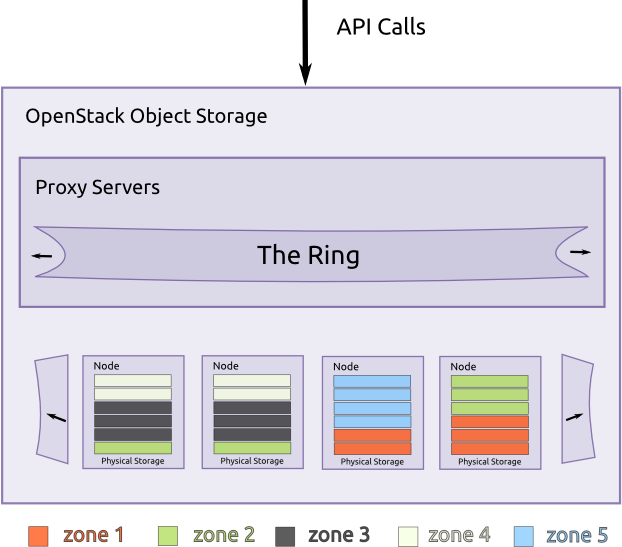
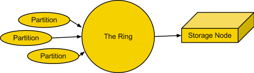
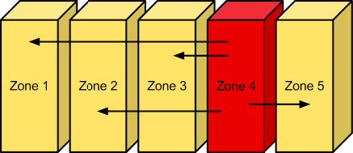
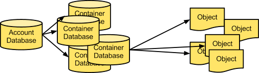
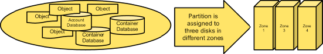
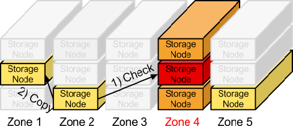
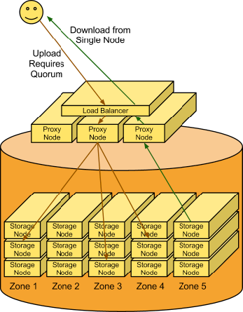

==========
Components
==========

Object Storage uses the following components to deliver high
availability, high durability, and high concurrency:

-  **Proxy servers** - Handle all of the incoming API requests.

-  **Rings** - Map logical names of data to locations on particular
   disks.

-  **Zones** - Isolate data from other zones. A failure in one zone
   does not impact the rest of the cluster as data replicates
   across zones.

-  **Accounts and containers** - Each account and container are
   individual databases that are distributed across the cluster. An
   account database contains the list of containers in that account. A
   container database contains the list of objects in that container.

-  **Objects** - The data itself.

-  **Partitions** - A partition stores objects, account databases, and
   container databases and helps manage locations where data lives in
   the cluster.

.. _objectstorage-building-blocks-figure:

**Object Storage building blocks**

Proxy servers
-------------

Proxy servers are the public face of Object Storage and handle all of
the incoming API requests. Once a proxy server receives a request, it
determines the storage node based on the object's URL, for example:
``https://swift.example.com/v1/account/container/object``. Proxy servers
also coordinate responses, handle failures, and coordinate timestamps.

Proxy servers use a shared-nothing architecture and can be scaled as
needed based on projected workloads. A minimum of two proxy servers
should be deployed behind a separately-managed load balancer. If one
proxy server fails, the others take over.

Rings
-----

A ring represents a mapping between the names of entities stored in the
cluster and their physical locations on disks. There are separate rings
for accounts, containers, and objects. When components of the system need
to perform an operation on an object, container, or account, they need to
interact with the corresponding ring to determine the appropriate location
in the cluster.

The ring maintains this mapping using zones, devices, partitions, and
replicas. Each partition in the ring is replicated, by default, three
times across the cluster, and partition locations are stored in the
mapping maintained by the ring. The ring is also responsible for
determining which devices are used as handoffs in failure scenarios.

Data can be isolated into zones in the ring. Each partition replica
will try to reside in a different zone. A zone could represent a
drive, a server, a cabinet, a switch, or even a data center.

The partitions of the ring are distributed among all of the devices
in the Object Storage installation. When partitions need to be moved
around (for example, if a device is added to the cluster), the ring
ensures that a minimum number of partitions are moved at a time, and
only one replica of a partition is moved at a time.

You can use weights to balance the distribution of partitions on drives
across the cluster. This can be useful, for example, when differently
sized drives are used in a cluster.

The ring is used by the proxy server and several background processes
(like replication).

.. _objectstorage-ring-figure:

**The ring**

These rings are externally managed. The server processes themselves
do not modify the rings, they are instead given new rings modified by
other tools.

The ring uses a configurable number of bits from an ``MD5`` hash for a path
as a partition index that designates a device. The number of bits kept
from the hash is known as the partition power, and 2 to the partition
power indicates the partition count. Partitioning the full ``MD5`` hash ring
allows other parts of the cluster to work in batches of items at once
which ends up either more efficient or at least less complex than
working with each item separately or the entire cluster all at once.

Another configurable value is the replica count, which indicates how
many of the partition-device assignments make up a single ring. For a
given partition index, each replica's device will not be in the same
zone as any other replica's device. Zones can be used to group devices
based on physical locations, power separations, network separations, or
any other attribute that would improve the availability of multiple
replicas at the same time.

Zones
-----

Object Storage allows configuring zones in order to isolate failure
boundaries. If possible, each data replica resides in a separate zone.
At the smallest level, a zone could be a single drive or a grouping of a
few drives. If there were five object storage servers, then each server
would represent its own zone. Larger deployments would have an entire
rack (or multiple racks) of object servers, each representing a zone.
The goal of zones is to allow the cluster to tolerate significant
outages of storage servers without losing all replicas of the data.

.. _objectstorage-zones-figure:

**Zones**

Accounts and containers
-----------------------

Each account and container is an individual SQLite database that is
distributed across the cluster. An account database contains the list of
containers in that account. A container database contains the list of
objects in that container.

.. _objectstorage-accountscontainers-figure:

**Accounts and containers**

To keep track of object data locations, each account in the system has a
database that references all of its containers, and each container
database references each object.

Partitions
----------

A partition is a collection of stored data. This includes account databases,
container databases, and objects. Partitions are core to the replication
system.

Think of a partition as a bin moving throughout a fulfillment center
warehouse. Individual orders get thrown into the bin. The system treats
that bin as a cohesive entity as it moves throughout the system. A bin
is easier to deal with than many little things. It makes for fewer
moving parts throughout the system.

System replicators and object uploads/downloads operate on partitions.
As the system scales up, its behavior continues to be predictable
because the number of partitions is a fixed number.

Implementing a partition is conceptually simple: a partition is just a
directory sitting on a disk with a corresponding hash table of what it
contains.

.. _objectstorage-partitions-figure:

**Partitions**

Replicators
-----------

In order to ensure that there are three copies of the data everywhere,
replicators continuously examine each partition. For each local
partition, the replicator compares it against the replicated copies in
the other zones to see if there are any differences.

The replicator knows if replication needs to take place by examining
hashes. A hash file is created for each partition, which contains hashes
of each directory in the partition. For a given partition, the hash files
for each of the partition's copies are compared. If the hashes are
different, then it is time to replicate, and the directory that needs to
be replicated is copied over.

This is where partitions come in handy. With fewer things in the system,
larger chunks of data are transferred around (rather than lots of little
TCP connections, which is inefficient) and there is a consistent number
of hashes to compare.

The cluster has an eventually-consistent behavior where old data may be
served from partitions that missed updates, but replication will cause
all partitions to converge toward the newest data.

.. _objectstorage-replication-figure:

**Replication**

If a zone goes down, one of the nodes containing a replica notices and
proactively copies data to a handoff location.

Use cases
---------

The following sections show use cases for object uploads and downloads
and introduce the components.

Upload
~~~~~~

A client uses the REST API to make a HTTP request to PUT an object into
an existing container. The cluster receives the request. First, the
system must figure out where the data is going to go. To do this, the
account name, container name, and object name are all used to determine
the partition where this object should live.

Then a lookup in the ring figures out which storage nodes contain the
partitions in question.

The data is then sent to each storage node where it is placed in the
appropriate partition. At least two of the three writes must be
successful before the client is notified that the upload was successful.

Next, the container database is updated asynchronously to reflect that
there is a new object in it.

.. _objectstorage-usecase-figure:

**Object Storage in use**

Download
~~~~~~~~

A request comes in for an account/container/object. Using the same
consistent hashing, the partition index is determined. A lookup in the
ring reveals which storage nodes contain that partition. A request is
made to one of the storage nodes to fetch the object and, if that fails,
requests are made to the other nodes.
