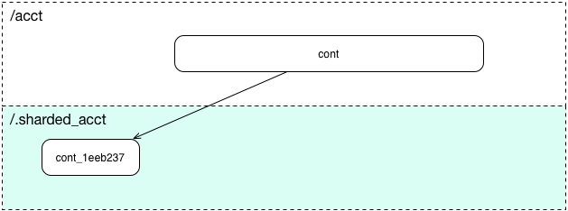
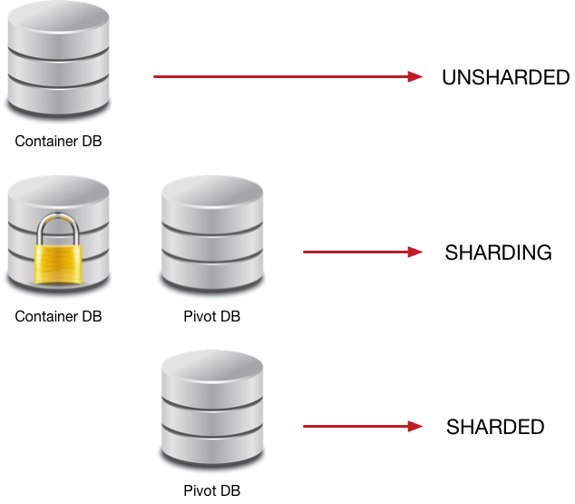
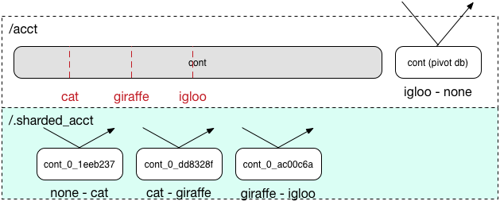
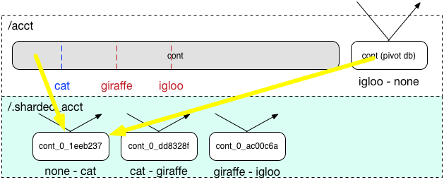
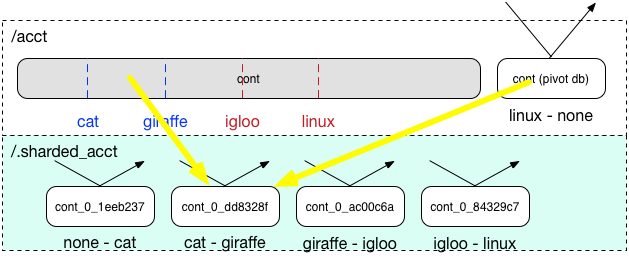
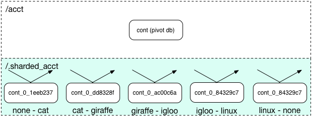
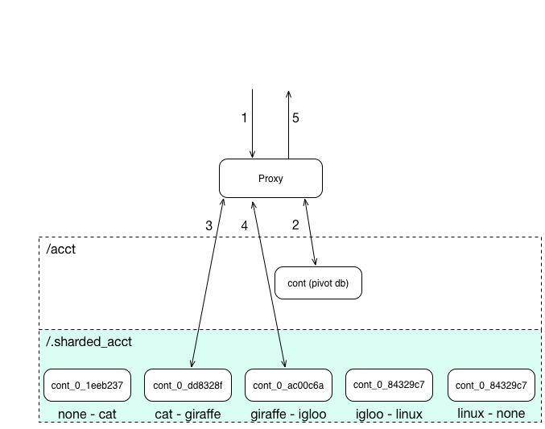
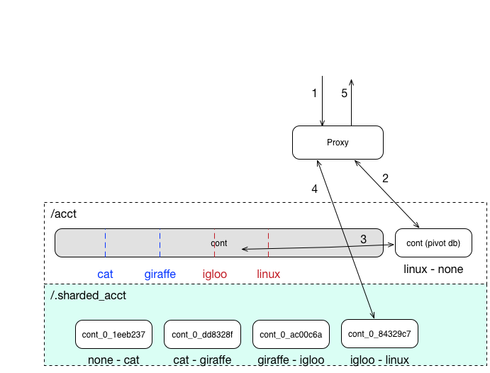

==================
Container Sharding
==================

---------------------------------------------
What is container sharding and why we need it
---------------------------------------------

Put simply, sharding is the process of splitting up some data across more
resources and that's what we are doing with the container metadata in Swift.

Swift's metadata layer (accounts and containers) is simply SQLite databases
that are treated like any other object in swift, that is, they are replicated
across the cluster. This keeps containers and accounts just as durable as any
object and allows swift to scale in the number of accounts and containers. The
problem is what happens when these SQLite databases get too big?

Let's take a step back. How do they become too big? Let's take a look at a
container, and what an SQLite container holds:

- Container level user metadata
- Container level system metadata
- Container level statistics
- List of objects that belong in the container

The first types of data we store don't take up too much space, unless there is
a *huge* amount of metadata stored in the container. So this isn't the problem.
The problem is the last item. A container stores a list of the objects that
live inside that container. It is this list that gets large.

We've seen containers containing millions and billions of objects. This simply
pushes the limits of storing it in a single file. When they get large, writing
to the SQLite files become slower due to write locks. Backend swift consistency
daemons also take longer dealing with, or trying to update, such large files.
This causes issues. So what we need to do is find a way of sharding away this
object list. So the large SQLite file becomes many smaller ones distributed
across the cluster, distributing not only the size but the load of update
requests as well.

----------------------------------
Sharding from a user's perspective
----------------------------------

From the user's perspective, there is no need to know anything about how
sharding happens. All a user needs to know is how to activate it on a
container.

Like the rest of swift's API, a user can turn on sharding by sending a piece of
metadata to the container in question. This allows a user to choose which
containers are sharded at a container level. To turn on sharding, all a user
has to do is send a ``X-Container-Sharding: on`` header via either a PUT or POST
to the container::

  curl -i -X POST -H 'X-Container-Sharding: on' \
  https://1.2.3.4/v1/<account>/<container>

Or via the swift client::

  swift post <container> -H 'X-Container-Sharding: on'

This process cannot be undone. Once turned on, the container will be sharded as
required by the sharding daemon. The user will not notice anything else, they
will only ever see the one container and as they interact with it, it will
behave as normal. The visiting of sharded databases happens behind the scenes.

Once a container is sharded, the container stats, bytes_used and object_count
will still be maintained in the container, but updated less often, so these
values may lag a bit.

---------------------------------------
Sharding from an operator's perspective
---------------------------------------

From an operator's perspective sharding is a little more complicated. There is
a container-sharder daemon that needs to be running on all the container
servers. As well as a bunch of variables/knobs that can be set/tuned.

Because the container-sharder will run on the container servers, the sharder
will use the container-server.conf as its configuration. So to configure the
container-sharder you just need to add the container-sharder section to the
config::

  [container-sharder]
  shard_container_size = 10000000
  shard_scanner_batch_size = 10
  shard_batch_size = 2
  shard_shrink_point = 50
  shard_shrink_merge_point = 75

Arguably these could all lose their shard_* prefixes.

Firstly, swift will need to know what size a container must reach before it is
ready for sharding. This is stored in a configuration item called
``shard_container_size``. The size of the shard as well as the 2 shrink settings,
above, are based of this value.

The ``shrink_point`` and ``shrink_merge_point`` settings, come into play when
the sharder finds a container shard that is small enough to merge into a
neighbour shard (shrink).

``shard_shrink_point`` is what size, as a percentage of ``shard_container_size``,
the list of objects in a container shard should be before being deemed small
enough to **attempt** to shrink.

``shard_shrink_merge_point`` is the next step, once a container shard is small
enough, this percentage of ``shard_container_size`` tells the sharder if the
combined size of the the small container and its neighbour is small enough to
complete the merge. To get more information, see the shrinking_ section below.

The 2 batch variables are used when sharding and to understand what they mean,
an understanding of how the container-sharder_ works is required. But suffice
it to say the ``scanner_batch_size`` is how many pivots a scanner will find on
each cycle and the ``batch_size`` is how many shards to shard on each cycle.

-----------------------------
Overview of sharding in Swift
-----------------------------

The basic and simplified idea is rather simple. Firstly, to enable container
sharding, pass in a ``X-Container-Sharding: On`` X-Header via either PUT or POST
to the container URL::

  curl -i -H 'X-Auth-Token: <token>' -H  \
  'X-Container-Sharding: On' <url>/<account>/<container> -X PUT

Sharding cannot be disabled once it has been enabled for a particular container.

If sharding has been enabled on a container that already exceeds
`shard_container_size` then pivot points are found to split the container on.
If it is a very large container, then it will be split multiple times. If
sharding is enabled on a smaller container then when that container reaches
`shard_container_size`, a single pivot point is found which will be used to
split the container. In this latter scenario, the container will only need to
be split once, meaning sharding is more efficient the sooner it is activated.

Each split creates an additional container shard holding ``n`` objects, where ``n``
is defined by::

  n = shard_container_size // 2

All new container shards exist in a separate account namespace based off the
user's account, meaning the user will only ever see one container in their
account namespace. This we call the ``root container``. The sharded namespace
is::

  .sharded_<account>/

Words can only explain so far, so let's take a look at some diagrams.

Slicing
-------

When we have a large container we need to split, one would think the best way
would be to split it in half. This works well when the container isn't too big.
But finding the middle is actually pretty hard, especially in SQLite on very
large containers <reference needed> where this doesn't scale. However, we don't
get the same performance loss if we slice a smaller chunk off the front. So
this is what we do. Turns out if we slice off 1/2 of ``shard_container_size``
then on containers that have sharding on and reach this size, we are
effectively slicing in the middle. But large containers that have sharding
turned on late will still shard. So slicing scales.

To really see what's happening lets take a very large container:

Here we have a container named 'cont' in an account named 'acct'. This
container is large and will need to be sharded.

The sharding daemon will find it and search for a pivot point to split it on:

Here the sharder has found that object 'f' would be a good first pivot point.
So we mark it. The sharder can then shard at this point:

At this point we'll pause for a moment, because now you can see that a shard is
given a unique name and placed in a hidden account that maps to the account
(.sharded_acct). This allows us to have no namespace collisions but also keeps
all the shards out of view from users of the account. Continuing on, we can see
that there is now a shard covering a range, and the root container has now also
shrunk, if we continue sharding this root container, we simply continue
searching for pivots and splitting:

.. image:: /images/sharding_snip4.png

Here we've found the next pivot point and then:

.. image:: /images/sharding_snip5.png

Now you can imagine we can continue snipping until we've fully sharded the
container. When we get to the end, all objects will exist in the shards,
leaving the root container only holding container metadata (user and system)
and references to the shard containers. So we can find the objects.

That's the general idea of how we shard. But there is more to it than that.

Large container optimisations
-----------------------------

When the sharder comes across a very large container, writes to the SQL
database can be rather expensive. So we want to minimise writes. Eventual
consistency also means deleting elements from the table will also be a write to
the object table, as we need a delete marker added so other primaries can
coalesce.

Further, a very large container in a sharding state is still large and has
problems, so we really want to get into the sharded state as quickly as
possible.

Batching
~~~~~~~~

In the slicing example above, we would find 1 pivot point and then shard it.
This works well when sharding is turned on from the start, as you'll only ever
need to make 1 slice. But on larger containers where more than 1 slice is
required it just wont scale. The rule is we want to get to the sharded state as
quickly as possible, so we need to speed things up, we need to shard in
batches.

The sharder daemon lives on all the container servers. It will periodically
scan all sharded containers to see if they need to be sharded. And if so, will
try and shard. We wont tie up the sharder and shard a very large container in
one go. Instead it will find pivots and/or shard in batches before moving to
the next container. On the next run, it'll continue where it left off.

When a sharder finds a pivot, it'll go create that shard, even though the new
shard database would be empty, this allows any new ingress requests for that
range to be redirected to the new shard. Taking load off the large container.
So scanning may take time, but the sooner you find it, less load will be
happening on the large container in question, in this case batching the search
for pivots also makes a lot of sense.

The batch sizes are configurable through the ``scanner_batch_size`` and
``batch_size`` options of the container-sharder daemon.

Two databases, the read-only database
~~~~~~~~~~~~~~~~~~~~~~~~~~~~~~~~~~~~~

As alluded to earlier, writing to a large container is what we really want to
avoid. Write locks on a very large container cause increased latency for the
container servers. But eventual consistency and POSTs to the container mean we
can't just stop writing. So what do we do?

We add another database, in place, then keep the big one as a read only source
while we shard. Once we complete sharding we can simply unlink the old database
freeing up space leaving only the second. This gives us 3 states that a
container can be in:

- UNSHARDED - There is just the standard container database, so all containers
  are by default in this state.
- SHARDING - There are now 2 databases, the container database and a pivot
  database. The pivot database will store any metadata, container level stats,
  an object holding table, and a table that stores references to container
  shards.
- SHARDED - There is only 1 database, the pivot database. This state only
  exists for a root container, as by the time a container shard being sharded
  gets to this state, it'll be marked as deleted as all pivot references exist
  in the root container.

So how does this work while sharding. Lets take a look:

Here we have a large container, cont, in a user account, acct. And this large
container's database has to deal with all updates, be they PUTs, DELETEs or
POSTs.

Being a really large database, the write locking would cause higher container
latency. So what we really want to do is shard it. To do that we need to turn
on sharding on the container 'cont'. Once this is done we wait for the
container-sharder daemon on one of the primaries to find it, and then start to
shard it.

We want to get this container to the SHARDED state as soon as possible, so we
don't want to waste the time it'll take for all primaries to scan for pivot
points, instead we need to determine which primary would be the scanner node.
So assuming 3x replication, the sharder will talk to the other 2 primaries and
try and get a majority quorum on who this scanner will be.

The scanner's job is to find all the pivot points, using its primary copy of
the database. The other primaries will only shard on pivots as they are
discovered, leaving them to continue to respond to ingress requests.

The sharder works very serially, meaning it deals with one container at a time
before moving onto the next. In the future we should break this down to happen
concurrently, but that isn't happening in version 1. This gives rise to a
balancing act, we want to get to the SHARDED state as soon as possible, so we
both search for pivots and shard on pivots in batches.

The scanner node will start by searching for a number of pivots. Once it's
found as much as it can it'll move to the SHARDING state, add the pivots to the
`privot_ranges` table and go create these shard containers as empty containers.
By creating these empty containers, we take load off the large container and
they will start being responsible for ingress requests coming in for their
respective ranges. The next picture will demonstrate this:

Here, the sharder has found 3 pivots, cat, giraffe and igloo. Because it's
found them it has created the container shards which have already started
dealing with ingress requests. These container shards are located in the
.sharded_acct account, which is a hidden account that maps to the user's.
Currently the container shards are empty and the actual data lies within the
'locked' container which is still yet to be sharded (moved to the shards).

The naming of the container shards is not in scope in this section, see
shard_naming_ to find out the how and why.

Because the first 3 shards exist, they have already started taking load off the
root container:

- cont_0_1eeb237 is dealing with anything <= cat;
- cont_0_dd8328f is dealing with anything > cat and <= giraffe;
- cont_0_ac00c6a is dealing with anything > giraffe and <= igloo;
- Finally the pivot database has an object holding table and is dealing with
  anything > igloo.

As you can see, the large container is not being written to. This means until
it's fully sharded we never need to write to it again. Further, as the scanner
node finds more and more pivots, the root container will deal with fewer and
fewer ingress requests.

The pivot database will now deal will all other writes meant for the container
being sharded, any user or system metadata updates, a place to store
replication syncs, and maintain container level statistics.

The scanner node, on each sharder cycle will find ``scanner_batch_size`` more
pivots. Once it's found them all then it'll finally start sharding itself.

Now we'll imagine one of the other primary nodes, one that wont be the scanner,
has a turn:

It'll know the list of currently found pivots because container replication
will pass the found pivots around to all the primaries. It sees that there are
pivots in the container to shard on, so it'll need to shard. Next, if its copy
of the database isn't in the SHARDING state then it'll first switch into that
state. And then it shards.

The blue line represents where the sharding is up to, red are unsharded pivots
(or found pivots). Each primary node keeps track of where it's up to, so it can
continue where it left off in next and subsequent sharder cycles.

Sharding itself is rather straight forward:

1. Create an empty container database in a handoff location locally.
2. Insert all the stale data from the locked (large) database.
3. Check the pivot databases object holding table to see if there is anything
   there that is related and merge it into the handoff database.
4. Use container replication to push it to the container shard primaries.
5. The shard's primary will get the database and merge it with any more-recent
   data it has.

This image just demonstrates that the process continues. The sharder is now
sharding the next pivot. While the scanner node is still searching for pivots.
See we have new one 'linux'. Now the root container only needs to deal with
requests dealing with objects whose name is greater than linux. So load will
continue to diminish.

Now this will continue until we get to the SHARDED state:

Once we have found the last pivot, the last container shard will be from that
pivot point to the end, so greater than 'linux' (> linux)

And we can see all ingress request load goes to the container shards. The root
container will always remain as we need a place to store container level
statistics, a reference to shards, and container level metadata.

This was an example of sharding a root container. However as container shards
grow, the same thing happens to them except for one small difference. We don't
keep the sharded pivot container around. The references to shards are in the
root container only, so a container shard once it hits the SHARDED state, can
be deleted.

------------------------
Sharding: Under the hood
------------------------

Terminology
-----------

================ ==================================================
Name             Description
================ ==================================================
Root container   The original container that lives in the
                 user's account. It holds references to all
                 its shard containers and non-sharding
                 container level metadata.
Shard container  A container that holds sharded data, and
                 lives in a hidden account mirroring the
                 user's account.
Pivot            A point in the object name namespace to split the
                 object metadata at.
Pivot range      The range of objects a shard container holds.
Misplaced items  Items that don't belong in the current container
                 shard or root container. These will be moved by
                 the container-sharder.
================ ==================================================

Container Backend and sharding
------------------------------

Pivot_ranges table
~~~~~~~~~~~~~~~~~~

A new table has been added to the container SQLite database, this table is
called pivot_ranges. It stores reference to the shards. This table will be
created on existing databases when first requested.

The table schema is::

  CREATE TABLE pivot_ranges (
      ROWID INTEGER PRIMARY KEY AUTOINCREMENT,
      name TEXT,
      lower TEXT,
      upper TEXT,
      object_count INTEGER DEFAULT 0,
      bytes_used INTEGER DEFAULT 0,
      created_at TEXT,
      meta_timestamp TEXT,
      deleted INTEGER DEFAULT 0
  );

You'll notice there are two timestamps, the created_at will track when it was
created or when something major happens like a smaller shard gets merged into
it. The meta_timestamp is updated when the stats are updated. And helps when
merging out of sync containers.

Container DB states
-------------------

The container backend now maintains a db_state. A new method ``get_db_state()``
has been added and an int will be returned which will indicate the state of the
container. These response ints are represented by::

  DB_STATE_NOTFOUND = 0
  DB_STATE_UNSHARDED = 1
  DB_STATE_SHARDING = 2
  DB_STATE_SHARDED = 3

The ``get_db_state()`` method checks to see what SQLite databases exist in the
directory:

- UNSHARDED - only the standard container database (<hash>.db).
- SHARDING - both the standard container database and a pivot one (<hash>.db
  and <hash>_pivot.db).
- SHARDED - only the pivot database (<hash>_pivot.db).

To move through the states there are some methods that do the work.

set_sharding_state()
~~~~~~~~~~~~~~~~~~~~
This method:

- Creates the pivot database
- Moves the current state of the read-only database's metadata over:

.. code-block:: python

  sub_broker.update_metadata(self.metadata)

- Move any defined pivot_ranges across, this can happen when not the scanner
  node and pivot ranges come across via replication.
- Sync the replication sync points, so replication can continue.
- And to make the replication life easier set the rowid of object table in the
  pivot database to match that of where the read-only database was up to, so it
  can continue where it left off. This makes continuing to replicate over the
  boundary of old and new databases much simpler.

set_sharded_state()
~~~~~~~~~~~~~~~~~~~

This is much simpler, it unlinks the old read-only database, but first checks
that you must be in the sharding state.

**Comments/Discussion:**

- We probably need to add checks to make sure we are ready to unlink. i.e check
  to see that sharding is complete.

The PivotRange class
--------------------

When we store pivot ranges, other than metadata and name, we only really store
the lower and upper bounds to describe the range. So the PivotRange class was
created to make interactions between ranges easier.

The class is pretty basic, it stores the timestamps, stats, lower and upper
values. The _contains_, _lt_, _gt_, iter and _eq_ methods have been overridden
so it can do checks against a string or another PivotRange.

The class also contains some extra helper methods:

- newer(other) - is it newer than another range.
- overlaps(other) - does this range overlap another range.

The PivotRange class lives in swift.common.utils, and there are some other
helper methods there that are used:

- find_pivot_range(item, ranges) - Finds what range from a list of ranges that
  an item belongs to.
- pivot_to_pivot_container(...) - Given a root container and account or a
  PivotRange, generate the required sharded name.
- account_to_pivot_account(account) - Generate the sharded account from the
  given account. This is where the name of pivot account that shadows the user
  account comes from:

.. code-block:: python

  def account_to_pivot_account(account):
    if not account:
        return account
    return ".sharded_%s" % account

Getting PivotRanges
-------------------

There are two ways of getting a list of PivotRanges and it depends on where you
are in swift. The easiest and most obvious way is to use a new method in the
ContainerBroker ``build_pivot_ranges()``.

The second is to ask the container for a list of pivot nodes rather than
objects. This is done with a GET to the container server, but with the
items=pivot parameter set::

  GET /acc/cont?items=pivot&format=json

You can then build a list of PivotRange objects. An example of how this is done
can be seen in the _get_pivot_ranges method in the container sharder daemon.

Replication and replicating pivots
----------------------------------

The container-replicator (and db_replicator as required) has been updated to
replicate and sync the pivot_range table.

Swift is eventually consistent, meaning at some point we will have an unsharded
version of a container replicated with a sharded one, and being eventually
consistent, some of the objects in the unsharded one might actually exist and
need to be merged into a different shard. The sharded container holds all its
objects in the leaves, leaving the root container’s object table as an object
holding table. In this case the objects can be synced into the root container's
holding table, and we can simply let the sharder pick them up and move them the
shards themselves.

pending and merge_items
~~~~~~~~~~~~~~~~~~~~~~~

The merge_items method in the container/backend.py has been modified to be
pivot range aware. That is to say, the list of items passed to it can now
contain a mix of objects and pivot_nodes. A new flag has been added to the
pending/pickle file format called record_type, which defaults to
RECORD_TYPE_OBJECT in existing pickle/pending files when unpickled. Merge_items
will sort into 2 different lists based on the record_type, then insert, update,
or delete the required tables accordingly.

Container replication changes
~~~~~~~~~~~~~~~~~~~~~~~~~~~~~

Because swift is an eventually consistent system, we need to make sure that
when container databases are replicated, this doesn’t only replicate items in
the objects table, but also the ranges in the pivot_ranges table as well. Most
of the database replication code is a part of the db_replicator which is a
parent, and so shared by account and container replication. Because of this, an
_other_items_hook(broker) hook has been added and the container replicator uses
this hook to grab the items from the pivot_range table and return in the items
format ready to be passed into merge_items.

There is a caveat however, which is that currently the hook grabs all the
objects from the pivot_points table on every replication.

_rsync_{db,file} and rpc complete_rsync changes
~~~~~~~~~~~~~~~~~~~~~~~~~~~~~~~~~~~~~~~~~~~~~~~

When we're in a SHARDING state, we have a problem. We now have to send 2
database files instead of 1. So now we need to:

- Send the filenames we will be rsyncing over, we send these as options to the
  rpc call.
- rsync both databases across, by naming them as::

    “../tmp/<local_id><filename>”

- The rpc replication end can then find both files and rename them to their
  correct names.

We are doing this, even if there is only 1 file sent, because on a rebalance a
sharded root container could be moved to the new priamry. And this needs to
maintain the ``<hash>_pivot.db`` name.

.. _container-sharder:

Container-Sharder
-----------------

The container-sharder daemon runs on the all the container servers, looks at
each container that has either had sharding enabled or is a container shard,
and will maintain all sharding aspects of it. It inherits from the
container-replicator making it a specialised replicator and uses
container-replication to move shard data around the cluster.

Overview
~~~~~~~~

The container-sharder will run on all container-server nodes. At an interval,
it will parse all sharded containers. On each it:

- Audits the container
- Deals with any misplaced items. That is items that should belong in a
  different range container.
- Checks the size of the container, when we do, **one** of the following
  happens:

  - If the container is big enough:

    - If the node is the scanner node, search for pivots or start pivoting. If
      scanner isn't defined it'll use group election to choose one.
    - If the node isn't the scanner and pivots are defined then start splitting
      on pivots.

  - If the container is small enough then it will shrink it.
  - If the container isn’t too big or small, just leave it.

- Finally the containers object_count and bytes_used is sent to the root
  container’s pivot_ranges table.

Scanning for pivots and pivoting is done in batches, so the sharding daemon
doesn't spend too much time on one particular container. Sharding is rather
complicated, so we go into more detail below.

Shrinking, going the other way, is in fact a two phase process, and is also in
covered in more detail below.

Audit
~~~~~

The sharder performs a basic audit which simply makes sure the current shard’s
range exists in the root’s pivot_ranges table. If it's the root container,
check to see if there are any overlapping or missing ranges.

If a container is missing from the root container's ranges then we need to
decide what to do. If there is another range that overlaps it and that
overlapping range is newer, then we can probably quarantine/delete the
container, noting that if a deleted container has object data then the sharder
will deal with them as misplaced objects.

The audit will also deal with any .sharding lock files that are stale due to a
container-sharder process hung/stalled/killed during a shard so it isn't
cleaned up. This way replication can happen on these containers.

**Comments/Discussion:**

- If the container happens to be newer, then what? Maybe the update is still
  pending on the container, do we wait a certain amount of time?
- Maybe if there are .sharding lock files older than reclaim_age we can say
  they are stale (that is to say if we speed up sharding by making it
  multi-process. ATM it's serial so would be easy to spot).

Misplaced items
~~~~~~~~~~~~~~~

A misplaced object is an object that is in the wrong shard. If it’s a deleted
shard (a shard that has shrunk, or been sharded), then anything in the object
table is misplaced and needs to be dealt with. On other nodes, a quick SQL
statement is enough to find out all the objects that are on the wrong side of
the pivot range in question.

A root container that is fully sharded, so in the SHARDED state. Has an object
holding table. Any objects in this table are considered misplaced, and data is
moved to the correct shard. This holding table can get filled, usually due to
replication syncs with nodes that haven't been sharded yet. But other tools
could in the future place items in there when they don't know where they should
belong.

The sharder uses the container-reconciler/replicator’s approach of creating a
container database locally in a handoff partition, loading it up, and then
using replication to push it over to where it needs to go.

Scanner node
~~~~~~~~~~~~

To get us from the UNSHARDED to the SHARDED state as quickly as possible, we
don't want all primary nodes scanning for pivots. Instead we choose one node to
be the scanner node, whose job it'll be to scan itself for pivot points. This
leaves the other nodes to respond to requests and only worry about sharding
when their sharder gets to it.

To determine who is the scanner node, we ask for a simple majority quorum from
all the primaries and whoever has the biggest object table will win and become
the scanner. The node id is written to the metadata of the container.

The scanner node will look at the defined ``scanner_batch_size`` and find that
many (at maximum) pivots. Once it's found some pivots, it'll ask for a majority
quorum again to make sure it is still the scanner, and if so will write the
found pivots to the pivot_ranges table. The other nodes will get these pivots
via container replication.

Once the scanner node has found all pivots, it'll set some metadata to say it
has::

  X-Container-Sysmeta-Sharding-Scan-Done

This way the other nodes will know when they've finished sharding. And then
it'll start sharding itself.

**Comments/Discussion:**

- Currently there is no check to see if the current scanner has stalled, died
  or been decommissioned. We should do something about that.

Sharding a container
~~~~~~~~~~~~~~~~~~~~

If the node isn't the scanner, or if the scanner has finished scanning, then
it's time to shard. If the node is not the scanner and it's the first time to
pivot, the database could still be in the UNSHARDED state, it will stay in this
state and no sharding will happen until there is something in the pivot_ranges
table. As soon as there is, it can ``set_sharding_state()``.

If this isn't the first time sharding, there will be a piece of metadata
telling the node where it's up to::

  X-Container-Sysmeta-Shard-Last-<node_id>: <pivot>

Like the scanner, we want to get to the SHARDED state as quickly as possible,
so it's also sharding in batches, this is defined by ``batch_size``. So for each
pivot range up to batch_size, either starting from the beginning or where we
left off, we:

#. Create a new container database locally in the handoff location.
#. Set the sharding lock on it.
#. Fill it up with the records for the pivot range from the read-only database.
#. Update it with any related data from the pivot database object holding table.
#. Remove the sharding lock.
#. Use container replication to push it to container shard.
#. Update the container ``Shard-Last-<node_id>`` metadata.

If we finish the last pivot, which we know if the scanner has set the metadata,
then we can unset this ``Shard-Last-<node_id>`` metadata and instead can mark it
as SHARDED.

The root container stores all container metadata, leaving the shards to only
need to hold sharding specific metadata. So every container shard will have the
following sysmeta:

- shard-account - Points to the root account
- shard-container - Points to the root container
- shard-lower - Lower range
- shard-upper - Upper range
- shard-timestamp - Pivot range metadata information when it's created.
- shard-meta-timestamp - Pivot range metadata information when it's created.
- sharding - exists or is True only during sharding. This stops the sharding daemon to pick up empty
  container shards and shrink them back into neighbours.

**Comments/Discussion:**

- Both the root account and root container name could be inferred from the
  shards path, so these could be removed.
- The timestamp metadata might be able to be cleaned up to. Can't remember why
  its there.
- The sharding metadata is currently stopping the daemon from shrinking with
  small containers. But we have a sharding lock now so maybe we should just use
  that instead. But how do we activate it and clean it? Or maybe we just need
  to introduce a time in which the containers can't be involved in a shrink
  after sharding. This could be a use of the timestamps above.

The .sharding lock
~~~~~~~~~~~~~~~~~~

While doing some testing on a really large container database an interesting
problem was stumbled upon. When the sharding container is really large, the
latency for sharding is slow, like everything else. This leads to a situation
where the sharded container isn't fully populated before a container replicator
finds it and replicates it where it's suppose to go. At first this doesn't
sound too bad.. but there are two problems with this:

1. Due to the way we currently shard, that is create a new broker in a handoff
   node then replicate, the new shard container may not exist anywhere else
   yet, so if a container-replicator picks it up while still sharding it'll
   happily rsync_then_merge. But this means when the sharding has finally
   completed there is a high chance the replicator will then use usync, and
   that means it could stick around on the handoff node for a long time. This
   isn't very efficient.

2. Worse still if the replicator grabs a smaller shard before it's finished, it
   will get to its final destinations on other storage nodes, and then when
   that node's sharder picks it up it may want to shrink it into a neighbour.

As you can imagine, 2 is a pain and can give rise to some interesting problems
or even loops. To solve this problem, the addition of a sharding lock has been
introduced. It is simply a .sharding file that gets dropped in the container
directory and removed when done. Replicators will now simply skip over a
container with a .sharding lock.

The sharding lock is implemented as a context managed function of the
ContainerBroker class:

.. code-block:: python

  @contextmanager
  def sharding_lock(self):
      lockpath = '%s/.sharding' % self.db_dir
      try:
          fd = os.open(lockpath, os.O_WRONLY | os.O_CREAT)
          yield fd
      finally:
          os.unlink(lockpath)

  def has_sharding_lock(self):
      lockpath = '%s/.sharding' % self.db_dir
      return os.path.exists(lockpath)

As mentioned earlier, care will need to be given when dealing with stale locks,
that will be a part of the sharders job.

.. _shard_naming:

Naming a shard container
~~~~~~~~~~~~~~~~~~~~~~~~

When we create a shard container we need to think of a name, and it should be a
name that doesn’t have any chance of name collisions in the future. Currently
the naming is done by:

.. code-block:: python

  md5sum = md5()
  md5sum.update("%s-%s" % (pivot, timestamp))
  return "%s-%d-%s" % (container, node_id, md5sum.hexdigest())

So looks something like::

  <container>-<node_id>-<MD5 of pivot + timestamp>

In the old versions we’d put the pivot point in the name, this though had the
side effect of potentially being reused on a very unlikely edge case, but more
importantly would mean the size of the container name could easily get too
large (depending on the pivot object's name). The MD5 helps keep the container
name to a consistent size.

**Comments/Discussion:**

- The addition of the node id just tells us which node was the scanner, so
  which node created it. This information isn't really used anywhere so could
  be dropped.
- Or maybe there is a better naming scheme we could use?

.. _shrinking:

Shrinking
~~~~~~~~~

Turns out shrinking (merging containers back when they get too small) is even
more complicated than sharding.

When sharding, we at least have all the objects that need to shard all on the
container server we were on. When shrinking, we need to find a range neighbour
that most likely lives somewhere else.

So how do we get around this? At the moment it’s another 2 phase process.

Shrinking happens during the sharding cycle loop. If a container has too few
items then the sharder will look into the possibility of shrinking the
container. Which starts at phase 1:

**Phase 1:**

#. Find out if the container really has few enough objects: that is a majority
   quorum of counts from all the primary nodes below the threshold (see below).
#. If there are few enough objects then check the neighbours to see if it’s
   possible to shrink/merge together, again this requires getting a quorum.
#. If all comes back successful set some metadata on the 2 containers to mark
   intention and so to stop other things shrinking or pivoting into the
   neighbour. The metadata set is:

::

  X-Container-Sysmeta-Shard-Merge: <neighbour>
  X-Container-Sysmeta-Shard-Shrink: <this container>

**Phase 2:**

#. Make sure we still have quorum on who the shrink and merge containers are.
#. Make an empty merge container in a handoff node, and set .sharding lock.
#. Move shrink items into the merge container.
#. Unlock .sharding lock and replicate containers. Updating the new lower/upper
   metadata in the merge container and updating the root container.
#. Delete the Shrink container.

Shrinking - small enough
~~~~~~~~~~~~~~~~~~~~~~~~

OK, so that’s all good and fine, but what is small enough, both from the
container and small enough neighbour?

Shrinking has added two new configuration parameters to the container-sharder
config section:

#. shard_shrink_point - percentage of shard_container_size that a container is
   deemed small enough to try and shrink. Default is 50%.
#. shard_shrink_merge_point - percentage of shard_container_size that a
   container will need to be below after the two containers have merged.
   Default is 75%.

The idea is, taking the defaults, when a container gets < 50% of
shard_container_size, then the sharder will look to see if there are any
neighbours that when its object count added to itself is < 75% of
shard_container_size then merge with it. If it can’t find a neighbour that will
be < 75% then we can’t shrink and the container will have to stay as it is.

If both neighbours are small enough to merge into, then we always pick the
smallest.

**Comments/Discussion:**

- After discussions with notmyname at LCA we might want to lower this to
  something really small, like 5%.

Updating Stats
~~~~~~~~~~~~~~
As you would expect, if we simply did a HEAD of the root container. The
bytes_used and object_count stats would come back at 0 or close to it. This is
because when sharded the root container doesn’t have any or has very few
objects in its objects table, as they’ve been sharded away.

A very slow and expensive approach to get the right stats is propagating the
HEAD to every container shard and then collating the results. This is very
expensive. So instead, the solution is to update the counts every now and
again. Because we are dealing with container shards that are also replicated,
there are a lot of counts out there to take into account, and this gets
complicated when they all need to update a single count in the root container.

This is why the pivot_ranges table now also stores the *current* count and
bytes_used for each range, as each range represents a sharded container, we now
have a place to update individually::

  CREATE TABLE pivot_ranges (
      ...
      object_count INTEGER DEFAULT 0,
      bytes_used INTEGER DEFAULT 0,
      ...
  );

When we container HEAD the root container all we need to do is sum up the
columns. This is what the ContainerBroker’s ``get_pivot_usage`` method does with
a simple SQL statement::

  SELECT sum(object_count), sum(bytes_used)
  FROM pivot_ranges
  WHERE deleted=0;

Some work has been done to be able to update these pivot_ranges so the stats
can be updated. You can now update them through a simple PUT or DELETE via the
container-server API. The pivot range API allows you to send a PUT/DELETE
request with some headers to update the pivot range, these headers are:

- x-backend-record-type - which must be RECORD_TYPE_PIVOT_NODE, otherwise it’ll
  be treated as an object.
- x-backend-pivot-objects - The object count, which can be prefixed with a - or
  + (More on this next).
- x-backend-pivot-bytes - The bytes used of the range, again can be prefixed
  with - or +.
- x-backend-pivot-lower - The lower range.
- x-backend-pivot-upper - The upper range.

**Note:** We use x-backend-* headers because these should only be used by swift’s backend.

The name of the object in the request would be the name of the pivot range
container.

The objects and bytes can optionally be prefixed with ‘-‘ or ‘+’. When they do
they effect the count accordingly. For example, if we want to define a new
value for the number of objects then we can::

	x-backend-pivot-objects: 100

This will set the number for the object_count stat for the range to 100. The
sharder sets the new count and bytes like this during each cycle to reflect the
current state of the world, seeing it knows best at the time. The API however
allows a request of::

	x-backend-pivot-object: +1

This would increment the current value. In this case it would make the new
value 101. A ‘-‘ will decrement.

The idea behind this is if an operator wants to sacrifice more requests in the
cluster with more up-to-date stats, we could get the object-updaters and
object-servers to send a + or - once an object is added or deleted. The sharder
would correct the count if it gets slightly out of sync.

The merge_items method in the ContainerBroker can merge prefixed requests
together (+2 etc) if required. However although currently implemented, it isn't
used anywhere in swift at the moment.

**Comments/Discussion:**

- The increment/decrement API was just an idea, and we could remove this
  functionality simplifying the pivot merge items code.

Container Updates and 300 redirects
-----------------------------------
When a new object PUT or DELETE comes in to the proxy, if the root container
has sharding enabled, then 2 additional headers are passed to the object
servers that will do the container update:

- X-Backend-Container-Update-Override-Backend-Pivot-Account
- X-Backend-Container-Update-Override-Backend-Pivot-Container

The nodes metadata that the object-server will use to know what container
servers to update we be the shards. We leave the current Account and Container
data as is, as the object-updater may need to know the root container to get a
new shard if the container is further sharded while sitting on disk as an async
pending.

As the object-server doesn't talk to rings, it can only attempt to talk to the
given nodes. So if the object-server fails to update the container server,
it'll be dropped as async pending.

On the container server side, if it gets a PUT to sharded container, and it
doesn't belong here, it'll respond with a 301 redirect. The object-server will
see this as a failure.

The object-updater on the other hand is a different beast. It does have access
to the rings, so it'll receive a 301 and be able to redirect to the correct
container shard. If the updater still fails to update the new shard then the
new shard account and container are added to the async file, so it can continue
where it left off next time. On the edge case that a redirect loop could be
introduced, the updater will only redirect twice before giving up until the
next round.

Container GET
-------------
Object listing when we are in one of the two new states, SHARDING and SHARDED,
is a little more complicated.

To start with, the proxy does the hard work, which makes sense because it has
all the smarts on how to talk to nodes and has access to the container ring.
When a container GET of a sharded root container comes into the proxy, it'll
send json GET requests to the containers in question and then build up the
response and send it back to the user.

It first needs to send a request to the root container asking for either all
the pivot ranges or all the pivot ranges responsible responding to the request,
if marker and/or end-marker is given.

The container-server API has grown a way of asking for pivot_ranges rather than
objects::

  GET <account>/<container>?items=pivot&format=json

If the marker, 'end_marker' is included, the container-server is smart enough
to only return the pivot ranges needed.

Now let's take a look at the new states to see how this works. We'll start with
SHARDED because that's an easier case.

SHARDED
~~~~~~~

The collection of objects happens in the proxy. In the diagram above we can see
the container GET request is asking for objects that extend over a pivot range
boundary, so lets follow the numbers:

1. The request comes into the proxy. The request must have at least a marker,
   and also perhaps and end_marker.
2. The proxy will ask the root container for a list of pivot ranges (shards)
   that are responsible for the range in the initial request. This could be
   something like:

::

  GET acc/cont?items=pivot&format=json&marker=frog&end_marker=hermit

3. The proxy now has references to cont_0_dd8328f and cont_0_ac00c6a, so sends
   the request to the former first.
4. Then sends the request to the next container, adjusting the limit.
5. It merges the results, formats them in the format the initial request
   requested and sends back the response.

SHARDING
~~~~~~~~

The sharding example is a little more complicated. As such, we've simplified
the incoming request. This time the range of the request fits into only one
range.

Like in the earlier diagrams, the blue lines indicate where the sharding is up
to, so in the above diagram we are asking for a range that hasn't been sharded
yet. This is on purpose, as if we did ask from something inside a blue range,
it'll be exactly like a sharded GET.

So let's follow the numbers again:

1. Like before the request comes into the proxy and this time the marker must
   put it after 'igloo'.
2. The proxy can see in container info that the container is sharding and where
   it's up to. It asks for the pivot ranges, if there are any, and then sends a
   GET request to the root container.
3. The root container, knowing that is hasn't sharded that area yet will ask
   the read-only database for the response, then ask the pivot database's object
   holding table for the same response and merges the answers together and returns
   the response to the proxy.
4. The proxy then asks the container shard, cont_0_84329c7, for what it has.
   This container shard would be mostly empty but will have any new ingress
   changes.
5. Like before the proxy will merge all these responses and sends a response.

When asking the container shard and the object holding table we need to include
deleted markers because objects in the read-only database are stale and an
ingress request might have deleted an object. The container backend now excepts
an 'include_deleted' to allow for this::

  GET <account>/<container>?items=all

Container PUT
-------------
As with container GET, the proxy is shard aware. When a container PUT comes in
with an object, the proxy can just ask what pivot node should handle this
request. In the PUT situation the proxy will again send a pivot GET to the
container server, but this time add the object as well::

  GET <account>/<container>/<object>?items=pivot&format=json

The response will be a single range, the range responsible for holding this
object.

Container DELETE
----------------
Deletes are pretty straightforward:

#. Receive a DELETE
#. Before applying to the root container, go apply to shards.
#. If all succeed then delete the root container.

But there is a problem, what happens if a shard returns a 409?

Cascade DELETES
~~~~~~~~~~~~~~~
Currently when a container DELETE is received, Swift will return a 409
(HTTPConflict) if the container isn't empty. That is to say if there is
something in the object table.

This is more problematic on sharded containers. As mentioned earlier, a DELETE
request is received by a container-server. Before applying it the root
container, it will first issue the DELETE request to all shard containers. Say
we get to the 6th container shard, and it still has an object. It'll return a
409, which we then can return as a response. However what happens to the first
5 container shards that are now marked as deleted?

**Comments/Discussion:**

- What to do in this situation?

- There are some options, and these are by no means the only options:

 #. Send a container PUT with the required metadata to create each container
    shard. But this involves extra requests to correct itself.
 #. Make the container-server more shard aware and create missing containers.

- Now that the object counts are stored in the root container for each
  container shard this might be less of a problem, because we can always check
  with the root container first. However what if those values lag?
