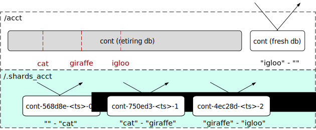
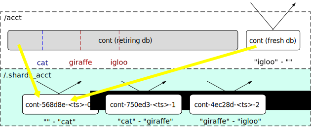
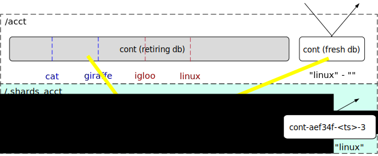

.. _sharding_doc:

==================
Container Sharding
==================

Container sharding is an operator controlled feature that may be used to shard
very large container databases into a number of smaller shard containers

.. note::

    Container sharding is currently an experimental feature. It is strongly
    recommended that operators gain experience of sharding containers in a
    non-production cluster before using in production.

    The sharding process involves moving all sharding container database
    records via the container replication engine; the time taken to complete
    sharding is dependent upon the existing cluster load and the performance of
    the container database being sharded.

    There is currently no documented process for reversing the sharding
    process once sharding has been enabled.

----------
Background
----------
The metadata for each container in Swift is stored in an SQLite database. This
metadata includes: information about the container such as its name,
modification time and current object count; user metadata that may been written
to the container by clients; a record of every object in the container. The
container database object records are used to generate container listings in
response to container GET requests; each object record stores the object's
name, size, hash and content-type as well as associated timestamps.

As the number of objects in a container increases then the number of object
records in the container database increases. Eventually the container database
performance starts to degrade and the time taken to update an object record
increases. This can result in object updates timing out, with a corresponding
increase in the backlog of pending :ref:`asynchronous updates
<architecture_updaters>` on object servers. Container databases are typically
replicated on several nodes and any database performance degradation can also
result in longer :doc:`container replication <overview_replication>` times.

The point at which container database performance starts to degrade depends
upon the choice of hardware in the container ring. Anecdotal evidence suggests
that containers with tens of millions of object records have noticeably
degraded performance.

This performance degradation can be avoided by ensuring that clients use an
object naming scheme that disperses objects across a number of containers
thereby distributing load across a number of container databases. However, that
is not always desirable nor is it under the control of the cluster operator.

Swift's container sharding feature provides the operator with a mechanism to
distribute the load on a single client-visible container across multiple,
hidden, shard containers, each of which stores a subset of the container's
object records. Clients are unaware of container sharding; clients continue to
use the same API to access a container that, if sharded, maps to a number of
shard containers within the Swift cluster.

------------------------
Deployment and operation
------------------------

Upgrade Considerations
----------------------

It is essential that all servers in a Swift cluster have been upgraded to
support the container sharding feature before attempting to shard a container.

Identifying containers in need of sharding
------------------------------------------

Container sharding is currently initiated by the ``swift-manage-shard-ranges``
CLI tool :ref:`described below <swift-manage-shard-ranges>`. Operators must
first identify containers that are candidates for sharding. To assist with
this, the :ref:`sharder_daemon` inspects the size of containers that it visits
and writes a list of sharding candidates to recon cache. For example::

    "sharding_candidates": {
        "found": 1,
        "top": [
            {
                "account": "AUTH_test",
                "container": "c1",
                "file_size": 497763328,
                "meta_timestamp": "1525346445.31161",
                "node_index": 2,
                "object_count": 3349028,
                "path": <path_to_db>,
                "root": "AUTH_test/c1"
            }
        ]
    }

A container is considered to be a sharding candidate if its object count is
greater than or equal to the ``shard_container_threshold`` option.
The number of candidates reported is limited to a number configured by the
``recon_candidates_limit`` option such that only the largest candidate
containers are included in the ``sharding_candidates`` data.

.. _swift-manage-shard-ranges:

``swift-manage-shard-ranges`` CLI tool
--------------------------------------

.. automodule:: swift.cli.manage_shard_ranges
    :members:
    :show-inheritance:

.. _sharder_daemon:

``container-sharder`` daemon
----------------------------

Once sharding has been enabled for a container, the act of sharding is
performed by the :ref:`container-sharder`.  The :ref:`container-sharder` daemon
must be running on all container servers. The ``container-sharder`` daemon
periodically visits each container database to perform any container sharding
tasks that are required.

The ``container-sharder`` daemon requires a ``[container-sharder]`` config
section to exist in the container server configuration file; a sample config
section is shown in the `container-server.conf-sample` file.

.. note::

    Several of the ``[container-sharder]`` config options are only significant
    when the ``auto_shard`` option is enabled. This option enables the
    ``container-sharder`` daemon to automatically identify containers that are
    candidates for sharding and initiate the sharding process, instead of using
    the ``swift-manage-shard-ranges`` tool. The ``auto_shard`` option is
    currently NOT recommended for production systems and shoud be set to
    ``false`` (the default value).

The container sharder uses an internal client and therefore requires an
internal client configuration file to exist. By default the internal-client
configuration file is expected to be found at
`/etc/swift/internal-client.conf`. An alternative location for the
configuration file may be specified using the ``internal_client_conf_path``
option in the ``[container-sharder]`` config section.

The content of the internal-client configuration file should be the same as the
`internal-client.conf-sample` file. In particular, the internal-client
configuration should have::

    account_autocreate = True

in the ``[proxy-server]`` section.

A container database may require several visits by the ``container-sharder``
daemon before it is fully sharded. On each visit the ``container-sharder``
daemon will move a subset of object records to new shard containers by cleaving
new shard container databases from the original. By default, two shards are
processed per visit; this number may be configured by the ``cleave_batch_size``
option.

The ``container-sharder`` daemon periodically writes progress data for
containers that are being sharded to recon cache. For example::

    "sharding_in_progress": {
        "all": [
            {
                "account": "AUTH_test",
                "active": 0,
                "cleaved": 2,
                "container": "c1",
                "created": 5,
                "db_state": "sharding",
                "error": null,
                "file_size": 26624,
                "found": 0,
                "meta_timestamp": "1525349617.46235",
                "node_index": 1,
                "object_count": 3349030,
                "path": <path_to_db>,
                "root": "AUTH_test/c1",
                "state": "sharding"
            }
        ]
    }

This example indicates that from a total of 7 shard ranges, 2 have been cleaved
whereas 5 remain in created state waiting to be cleaved.

Shard containers are created in an internal account and not visible to clients.
By default, shard containers for an account ``AUTH_test`` are created in the
internal account ``.shards_AUTH_test``.

Once a container has started sharding, object updates to that container may be
redirected to the shard container. The ``container-sharder`` daemon is also
responsible for sending updates of a shard's object count and bytes_used to the
original container so that aggegrate object count and bytes used values can be
returned in responses to client requests.

.. note::

    The ``container-sharder`` daemon must continue to run on all container
    servers in order for shards object stats updates to be generated.

--------------
Under the hood
--------------

Terminology
-----------

================== ====================================================
Name               Description
================== ====================================================
Root container     The original container that lives in the
                   user's account. It holds references to its
                   shard containers.
Retiring DB        The original database file that is to be sharded.
Fresh DB           A database file that will replace the retiring
                   database.
Epoch              A timestamp at which the fresh DB is created; the
                   epoch value is embedded in the fresh DB filename.
Shard range        A range of the object namespace defined by a lower
                   bound and upper bound.
Shard container    A container that holds object records for a shard
                   range. Shard containers exist in a hidden account
                   mirroring the user's account.
Parent container   The container from which a shard container has been
                   cleaved. When first sharding a root container each
                   shard's parent container will be the root container.
                   When sharding a shard container each shard's parent
                   container will be the sharding shard container.
Misplaced objects  Items that don't belong in a container's shard
                   range. These will be moved to their correct
                   location by the container-sharder.
Cleaving           The act of moving object records within a shard
                   range to a shard container database.
Shrinking          The act of merging a small shard container into
                   another shard container in order to delete the
                   small shard container.
Donor              The shard range that is shrinking away.
Acceptor           The shard range into which a donor is merged.
================== ====================================================

Finding shard ranges
--------------------

The end goal of sharding a container is to replace the original container
database which has grown very large with a number of shard container databases,
each of which is responsible for storing a range of the entire object
namespace. The first step towards achieving this is to identify an appropriate
set of contiguous object namespaces, known as shard ranges, each of which
contains a similar sized portion of the container's current object content.

Shard ranges cannot simply be selected by sharding the namespace uniformly,
because object names are not guaranteed to be distributed uniformly. If the
container were naively sharded into two shard ranges, one containing all
object names up to `m` and the other containing all object names beyond `m`,
then if all object names actually start with `o` the outcome would be an
extremely unbalanced pair of shard containers.

It is also too simplistic to assume that every container that requires sharding
can be sharded into two. This might be the goal in the ideal world, but in
practice there will be containers that have grown very large and should be
sharded into many shards. Furthermore, the time required to find the exact
mid-point of the existing object names in a large SQLite database would
increase with container size.

For these reasons, shard ranges of size `N` are found by searching for the
`Nth` object in the database table, sorted by object name, and then searching
for the `(2 * N)th` object, and so on until all objects have been searched. For
a container that has exactly `2N` objects, the end result is the same as
sharding the container at the midpoint of its object names. In practice
sharding would typically be enabled for containers with great than `2N` objects
and more than two shard ranges will be found, the last one probably containing
less than `N` objects. With containers having large multiples of `N` objects,
shard ranges can be identified in batches which enables more scalable solution.

To illustrate this process, consider a very large container in a user account
``acct`` that is a candidate for sharding:

The :ref:`swift-manage-shard-ranges` tool ``find`` sub-command searches the
object table for the `Nth` object whose name will become the upper bound of the
first shard range, and the lower bound of the second shard range. The lower
bound of the first shard range is the empty string.

For the purposes of this example the first upper bound is `cat`:

:ref:`swift-manage-shard-ranges` continues to search the container to find
further shard ranges, with the final upper bound also being the empty string.

Enabling sharding
-----------------

Once shard ranges have been found the :ref:`swift-manage-shard-ranges`
``replace`` sub-command is used to insert them into the `shard_ranges` table
of the container database. In addition to its lower and upper bounds, each
shard range is given a unique name.

The ``enable`` sub-command then creates some final state required to initiate
sharding the container, including a special shard range record referred to as
the container's `own_shard_range` whose name is equal to the container's path.
This is used to keep a record of the object namespace that the container
covers, which for user containers is always the entire namespace. Sharding of
the container will only begin when its own shard range's state has been set to
``SHARDING``.

The :class:`~swift.common.utils.ShardRange` class
-------------------------------------------------

The :class:`~swift.common.utils.ShardRange` class provides methods for
interactng with the attributes and state of a shard range. The class
encapsulates the following properties:

* The name of the shard range which is also the name of the shard container
  used to hold object records in its namespace.
* Lower and upper bounds which define the object namespace of the shard range.
* A deleted flag.
* A timestamp at which the bounds and deleted flag were last modified.
* The object stats for the shard range i.e. object count and bytes used.
* A timestamp at which the object stats were last modified.
* The state of the shard range, and an epoch, which is the timestamp used in
  the shard container's database file name.
* A timestamp at which the state and epoch were last modified.

A shard range progresses through the following states:

* FOUND: the shard range has been identified in the container that is to be
  sharded but no resources have been created for it.
* CREATED: a shard container has been created to store the contents of the
  shard range.
* CLEAVED: the sharding container's contents for the shard range have been
  copied to the shard container from *at least one replica* of the sharding
  container.
* ACTIVE: a sharding container's constituent shard ranges are moved to this
  state when all shard ranges in the sharding container have been cleaved.
* SHRINKING: the shard range has been enabled for shrinking; or
* SHARDING: the shard range has been enabled for sharding into further
  sub-shards.
* SHARDED: the shard range has completed sharding or shrinking; the container
  will typically now have a number of constituent ACTIVE shard ranges.

.. note::

    Shard range state represents the most advanced state of the shard range on
    any replica of the container. For example, a shard range in CLEAVED state
    may not have completed cleaving on all replicas but has cleaved on at least
    one replica.

Fresh and retiring database files
---------------------------------

As alluded to earlier, writing to a large container causes increased latency
for the container servers. Once sharding has been initiated on a container it
is desirable to stop writing to the large database; ultimately it will be
unlinked. This is primarily achieved by redirecting object updates to new shard
containers as they are created (see :ref:`redirecting_updates` below), but some
object updates may still need to be accepted by the root container and other
container metadata must still be modifiable.

To render the large `retiring` database effectively read-only, when the
:ref:`sharder_daemon` finds a container with a set of shard range records,
including an `own_shard_range`, it first creates a fresh database file which
will ultimately replace the existing `retiring` database. For a retiring DB
whose filename is::

    <hash>.db

the fresh database file name is of the form::

    <hash>_<epoch>.db

where `epoch` is a timestamp stored in the container's `own_shard_range`.

The fresh DB has a copy of the shard ranges table from the retiring DB and all
other container metadata apart from the object records. Once a fresh DB file
has been created it is used to store any new object updates and no more object
records are written to the retiring DB file.

Once the sharding process has completed, the retiring DB file will be unlinked
leaving only the fresh DB file in the container's directory. There are
therefore three states that the container DB directory may be in during the
sharding process: UNSHARDED, SHARDING and SHARDED.

.. image:: images/sharding_db_states.svg

If the container ever shrink to the point that is has no shards then the fresh
DB starts to store object records, behaving the same as an unsharded container.
This is known as the COLLAPSED state.

In summary, the DB states that any container replica may be in are:

- UNSHARDED - In this state there is just one standard container database. All
  containers are originally in this state.
- SHARDING - There are now two databases, the retiring database and a fresh
  database. The fresh database stores any metadata, container level stats,
  an object holding table, and a table that stores shard ranges.
- SHARDED - There is only one database, the fresh database, which has one or
  more shard ranges in addition to its own shard range. The retiring database
  has been unlinked.
- COLLAPSED - There is only one database, the fresh database, which has only
  its its own shard range and store object records.

.. note::

    DB state is unique to each replica of a container and is not necessarily
    synchronised with shard range state.

Creating shard containers
-------------------------

The :ref:`sharder_daemon` next creates a shard container for each shard range
using the shard range name as the name of the shard container:

.. image:: /images/sharding_cleave_basic.svg

Each shard container has an `own_shard_range` record which has the
lower and upper bounds of the object namespace for which it is responsible, and
a reference to the sharding user container, which is referred to as the
`root_container`. Unlike the `root_container`, the shard container's
`own_shard_range` does not cover the entire namepsace.

A shard range name takes the form ``<shard_a>/<shard_c>`` where `<shard_a>`
is a hidden account and `<shard_c>` is a container name that is derived from
the root container.

The account name `<shard_a>` used for shard containers is formed by prefixing
the user account with the string ``.shards_``. This avoids namespace collisions
and also keeps all the shard containers out of view from users of the account.

The container name for each shard container has the form::

  <root container name>-<hash of parent container>-<timestamp>-<shard index>

where `root container name` is the name of the user container to which the
contents of the shard container belong, `parent container` is the name of the
container from which the shard is being cleaved, `timestamp` is the time at
which the shard range was created and `shard index` is the position of the
shard range in the name-ordered list of shard ranges for the `parent
container`.

When sharding a user container the parent container name will be the same as
the root container. However, if a *shard container* grows to a size that it
requires sharding, then the parent container name for its shards will be the
name of the sharding shard container.

For example, consider a user container with path ``AUTH_user/c`` which is
sharded into two shard containers whose name will be::

  .shards_AUTH_user/c-<hash(c)>-1234512345.12345-0
  .shards_AUTH_user/c-<hash(c)>-1234512345.12345-1

If the first shard container is subsequently sharded into a further two shard
containers then they will be named::

  .shards_AUTH_user/c-<hash(c-<hash(c)>-1234567890.12345-0)>-1234567890.12345-0
  .shards_AUTH_user/c-<hash(c-<hash(c)>-1234567890.12345-0)>-1234567890.12345-1

This naming scheme guarantees that shards, and shards of shards, each have a
unique name of bounded length.

Cleaving shard containers
-------------------------

Having created empty shard containers the sharder daemon will proceed to cleave
objects from the retiring database to each shard range. Cleaving occurs in
batches of two (by default) shard ranges, so if a container has more than two
shard ranges then the daemon must visit it multiple times to complete cleaving.

To cleave a shard range the daemon creates a shard database for the shard
container on a local device. This device may be one of the shard container's
primary nodes but often it will not. Object records from the corresponding
shard range namespace are then copied from the retiring DB to this shard DB.

Swift's container replication mechanism is then used to replicate the shard DB
to its primary nodes. Checks are made to ensure that the new shard container DB
has been replicated to a sufficient number of its primary nodes before it is
considered to have been successfully cleaved. By default the daemon requires
successful replication of a new shard broker to at least a quorum of the
container rings replica count, but this requirement can be tuned using the
``shard_replication_quorum`` option.

Once a shard range has been successfully cleaved from a retiring database the
daemon transitions its state to ``CLEAVED``. It should be noted that this state
transition occurs as soon as any one of the retiring DB replicas has cleaved
the shard range, and therefore does not imply that all retiring DB replicas
have cleaved that range. The significance of the state transition is that the
shard container is now considered suitable for contributing to object listings,
since its contents are present on a quorum of its primary nodes and are the
same as at least one of the retiring DBs for that namespace.

Once a shard range is in the ``CLEAVED`` state, the requirement for
'successful' cleaving of other instances of the retirng DB may optionally be
relaxed since it is not so imperative that their contents are replicated
*immediately* to their primary nodes. The ``existing_shard_replication_quorum``
option can be used to reduce the quorum required for a cleaved shard range to
be considered successfully replicated by the sharder daemon.

.. note::

    Once cleaved, shard container DBs will continue to be replicated by the
    normal `container-replicator` daemon so that they will eventually be fully
    replicated to all primary nodes regardless of any replication quorum options
    used by the sharder daemon.

The cleaving progress of each replica of a retiring DB must be
tracked independently of the shard range state. This is done using a per-DB
CleavingContext object that maintains a cleaving cursor for the retiring DB
that it is associated with. The cleaving cursor is simply the upper bound of
the last shard range to have been cleaved *from that particular retiring DB*.

Each CleavingContext is stored in the sharding container's sysmeta under a key
that is the ``id`` of the retiring DB. Since all container DB files have a
unique ``id``, this guarantees that each retiring DB will have a unique
CleavingContext. Furthermore, if the retiring DB file is changed, for example
by an rsync_then_merge replication operation which might change the contents of
the DB's object table, then it will get a new unique CleavingContext.

A CleavingContext maintains other state that is used to ensure that a retiring
DB is only considered to be fully cleaved, and ready to be deleted, if *all* of
its object rows have been cleaved to a shard range.

Once all shard ranges have been cleaved from the retiring DB it is deleted. The
container is now represented by the fresh DB which has a table of shard range
records that point to the shard containers that store the container's object
records.

.. _redirecting_updates:

Redirecting object updates
--------------------------

Once a shard container exists, object updates arising from new client requests
and async pending files are directed to the shard container instead of the root
container. This takes load off of the root container.

For a sharded (or partially sharded) container, when the proxy receives a new
object request it issues a GET request to the container for data describing a
shard container to which the object update should be sent. The proxy then
annotates the object request with the shard container location so that the
object server will forward object updates to the shard container. If those
updates fail then the async pending file that is written on the object server
contains the shard container location.

When the object updater processes async pending files for previously failed
object updates, it may not find a shard container location. In this case the
updater sends the update to the `root container`, which returns a redirection
response with the shard container location.

.. note::

    Object updates are directed to shard containers as soon as they exist, even
    if the retiring DB object records have not yet been cleaved to the shard
    container. This prevents further writes to the retiring DB and also avoids
    the fresh DB being polluted by new object updates. The goal is to
    ultimately have all object records in the shard containers and none in the
    root container.

Building container listings
---------------------------

Listing requests for a sharded container are handled by querying the shard
containers for components of the listing. The proxy forwards the client listing
request to the root container, as it would for an unsharded container, but the
container server responds with a list of shard ranges rather than objects. The
proxy then queries each shard container in namespace order for their listing,
until either the listing length limit is reached or all shard ranges have been
listed.

While a container is still in the process of sharding, only *cleaved* shard
ranges are used when building a container listing. Shard ranges that have not
yet cleaved will not have any object records from the root container. The root
container continues to provide listings for the uncleaved part of its
namespace.

.. note::

   New object updates are redirected to shard containers that have not yet been
   cleaved. These updates will not therefore be included in container listings
   until their shard range has been cleaved.

Example request redirection
---------------------------

As an example, consider a sharding container in which 3 shard ranges have been
found ending in cat, giraffe and igloo. Their respective shard containers have
been created so update requests for objects up to "igloo" are redirected to the
appropriate shard container. The root DB continues to handle listing requests
and update requests for any object name beyond "igloo".

The sharder daemon cleaves objects from the retiring DB to the shard range DBs;
it also moves any misplaced objects from the root container's fresh DB to the
shard DB. Cleaving progress is represented by the blue line. Once the first
shard range has been cleaved listing requests for that namespace are directed
to the shard container. The root container still provides listings for the
remainder of the namespace.

The process continues: the sharder cleaves the next range and a new range is
found with upper bound of "linux". Now the root container only needs to handle
listing requests up to "giraffe" and update requests for objects whose name is
greater than "linux". Load will continue to diminish on the root DB and be
dispersed across the shard DBs.

Container replication
---------------------

Shard range records are replicated between container DB replicas in much the
same way as object records are for unsharded containers. However, the usual
replication of object records between replicas of a container is halted as soon
as a container is capable of being sharded. Instead, object records are moved
to their new locations in shard containers. This avoids unnecessary replication
traffic between container replicas.

To facilitate this, shard ranges are both 'pushed' and 'pulled' during
replication, prior to any attempt to replicate objects. This means that the
node initiating replication learns about shard ranges from the destination node
early during the replication process and is able to skip object replication if
it discovers that it has shard ranges and is able to shard.

.. note::

    When the destination DB for container replication is missing then the
    'complete_rsync' replication mechanism is still used and in this case only
    both object records and shard range records are copied to the destination
    node.

Container deletion
------------------

Sharded containers may be deleted by a ``DELETE`` request just like an
unsharded container. A sharded container must be empty before it can be deleted
which implies that all of its shard containers must have reported that they are
empty.

Shard containers are *not* immediately deleted when their root container is
deleted; the shard containers remain undeleted so that they are able to
continue to receive object updates that might arrive after the root container
has been deleted. Shard containers continue to update their deleted root
container with their object stats. If a shard container does receive object
updates that cause it to no longer be empty then the root container will no
longer be considered deleted once that shard container sends an object stats
update.

Sharding a shard container
--------------------------

A shard container may grow to a size that requires it to be sharded.
``swift-manage-shard-ranges`` may be used to identify shard ranges within a
shard container and enable sharding in the same way as for a root container.
When a shard is sharding it notifies the root container of its shard ranges so
that the root container can start to redirect object updates to the new
'sub-shards'. When the shard has completed sharding the root is aware of all
the new sub-shards and the sharding shard deletes its shard range record in the
root container shard ranges table. At this point the root container is aware of
all the new sub-shards which collectively cover the namespace of the
now-deleted shard.

There is no hierarchy of shards beyond the root container and its immediate
shards. When a shard shards, its sub-shards are effectively re-parented with
the root container.

Shrinking a shard container
---------------------------

A shard container's contents may reduce to a point where the shard container is
no longer required. If this happens then the shard container may be shrunk into
another shard range. Shrinking is achieved in a similar way to sharding: an
'acceptor' shard range is written to the shrinking shard container's shard
ranges table; unlike sharding, where shard ranges each cover a subset of the
sharding container's namespace, the acceptor shard range is a superset of the
shrinking shard range.

Once given an acceptor shard range the shrinking shard will cleave itself to
its acceptor, and then delete itself from the root container shard ranges
table.
