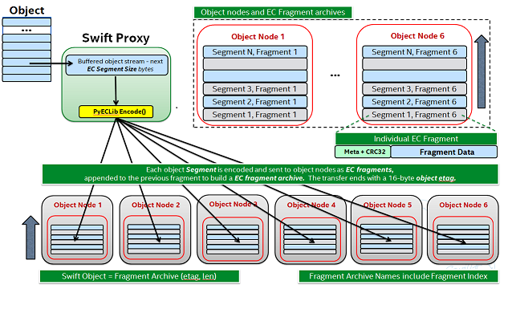

====================
Erasure Code Support
====================

-------------------------------
History and Theory of Operation
-------------------------------

There's a lot of good material out there on Erasure Code (EC) theory, this short
introduction is just meant to provide some basic context to help the reader
better understand the implementation in Swift.

Erasure Coding for storage applications grew out of Coding Theory as far back as
the 1960s with the Reed-Solomon codes.  These codes have been used for years in
applications ranging from CDs to DVDs to general communications and, yes, even
in the space program starting with Voyager! The basic idea is that some amount
of data is broken up into smaller pieces called fragments and coded in such a
way that it can be transmitted with the ability to tolerate the loss of some
number of the coded fragments.  That's where the word "erasure" comes in, if you
transmit 14 fragments and only 13 are received then one of them is said to be
"erased".  The word "erasure" provides an important distinction with EC; it
isn't about detecting errors, it's about dealing with failures.  Another
important element of EC is that the number of erasures that can be tolerated can
be adjusted to meet the needs of the application.

At a high level EC works by using a specific scheme to break up a single data
buffer into several smaller data buffers then, depending on the scheme,
performing some encoding operation on that data in order to generate additional
information.  So you end up with more data than you started with and that extra
data is often called "parity".  Note that there are many, many different
encoding techniques that vary both in how they organize and manipulate the data
as well by what means they use to calculate parity.  For example, one scheme
might rely on `Galois Field Arithmetic <http://www.ssrc.ucsc.edu/Papers/plank-
fast13.pdf>`_ while others may work with only XOR. The number of variations and
details about their differences are well beyond the scope of this introduction,
but we will talk more about a few of them when we get into the implementation of
EC in Swift.

--------------------------------
Overview of EC Support in Swift
--------------------------------

First and foremost, from an application perspective EC support is totally
transparent. There are no EC related external API; a container is simply created
using a Storage Policy defined to use EC and then interaction with the cluster
is the same as any other durability policy.

EC is implemented in Swift as a Storage Policy, see :doc:`overview_policies` for
complete details on Storage Policies.  Because support is implemented as a
Storage Policy, all of the storage devices associated with your cluster's EC
capability can be isolated.  It is entirely possible to share devices between
storage policies, but for EC it may make more sense to not only use separate
devices but possibly even entire nodes dedicated for EC.

Which direction one chooses depends on why the EC policy is being deployed.  If,
for example, there is a production replication policy in place already and the
goal is to add a cold storage tier such that the existing nodes performing
replication are impacted as little as possible, adding a new set of nodes
dedicated to EC might make the most sense but also incurs the most cost.  On the
other hand, if EC is being added as a capability to provide additional
durability for a specific set of applications and the existing infrastructure is
well suited for EC (sufficient number of nodes, zones for the EC scheme that is
chosen) then leveraging the existing infrastructure such that the EC ring shares
nodes with the replication ring makes the most sense.  These are some of the
main considerations:

* Layout of existing infrastructure.
* Cost of adding dedicated EC nodes (or just dedicated EC devices).
* Intended usage model(s).

The Swift code base does not include any of the algorithms necessary to perform
the actual encoding and decoding of data; that is left to external libraries.
The Storage Policies architecture is leveraged to enable EC on a per container
basis -- the object rings are still used to determine the placement of EC data
fragments. Although there are several code paths that are unique to an operation
associated with an EC policy, an external dependency to an Erasure Code library
is what Swift counts on to perform the low level EC functions.  The use of an
external library allows for maximum flexibility as there are a significant
number of options out there, each with its owns pros and cons that can vary
greatly from one use case to another.

---------------------------------------
PyECLib:  External Erasure Code Library
---------------------------------------

PyECLib is a Python Erasure Coding Library originally designed and written as
part of the effort to add EC support to the Swift project, however it is an
independent project.  The library provides a well-defined and simple Python
interface and internally implements a plug-in architecture allowing it to take
advantage of many well-known C libraries such as:

* Jerasure and GFComplete at http://jerasure.org.
* Intel(R) ISA-L at http://01.org/intel%C2%AE-storage-acceleration-library-open-source-version.
* Or write your own!

PyECLib uses a C based library called liberasurecode to implement the plug in
infrastructure; liberasure code is available at:

* liberasurecode: https://github.com/openstack/liberasurecode

PyECLib itself therefore allows for not only choice but further extensibility as
well. PyECLib also comes with a handy utility to help determine the best
algorithm to use based on the equipment that will be used (processors and server
configurations may vary in performance per algorithm).  More on this will be
covered in the configuration section.  PyECLib is included as a Swift
requirement.

For complete details see `PyECLib <https://github.com/openstack/pyeclib>`_

------------------------------
Storing and Retrieving Objects
------------------------------

We will discuss the details of how PUT and GET work in the "Under the Hood"
section later on. The key point here is that all of the erasure code work goes
on behind the scenes; this summary is a high level information overview only.

The PUT flow looks like this:

#. The proxy server streams in an object and buffers up "a segment" of data
   (size is configurable).
#. The proxy server calls on PyECLib to encode the data into smaller fragments.
#. The proxy streams the encoded fragments out to the storage nodes based on
   ring locations.
#. Repeat until the client is done sending data.
#. The client is notified of completion when a quorum is met.

The GET flow looks like this:

#. The proxy server makes simultaneous requests to participating nodes.
#. As soon as the proxy has the fragments it needs, it calls on PyECLib to
   decode the data.
#. The proxy streams the decoded data it has back to the client.
#. Repeat until the proxy is done sending data back to the client.

It may sound like, from this high level overview, that using EC is going to
cause an explosion in the number of actual files stored in each node's local
file system.  Although it is true that more files will be stored (because an
object is broken into pieces), the implementation works to minimize this where
possible, more details are available in the Under the Hood section.

-------------
Handoff Nodes
-------------

In EC policies, similarly to replication, handoff nodes are a set of storage
nodes used to augment the list of primary nodes responsible for storing an
erasure coded object. These handoff nodes are used in the event that one or more
of the primaries are unavailable.  Handoff nodes are still selected with an
attempt to achieve maximum separation of the data being placed.

--------------
Reconstruction
--------------

For an EC policy, reconstruction is analogous to the process of replication for
a replication type policy -- essentially "the reconstructor" replaces "the
replicator" for EC policy types. The basic framework of reconstruction is very
similar to that of replication with a few notable exceptions:

* Because EC does not actually replicate partitions, it needs to operate at a
  finer granularity than what is provided with rsync, therefore EC leverages
  much of ssync behind the scenes (you do not need to manually configure ssync).
* Once a pair of nodes has determined the need to replace a missing object
  fragment, instead of pushing over a copy like replication would do, the
  reconstructor has to read in enough surviving fragments from other nodes and
  perform a local reconstruction before it has the correct data to push to the
  other node.
* A reconstructor does not talk to all other reconstructors in the set of nodes
  responsible for an EC partition, this would be far too chatty, instead each
  reconstructor is responsible for sync'ing with the partition's closest two
  neighbors (closest meaning left and right on the ring).

.. note::

    EC work (encode and decode) takes place both on the proxy nodes, for PUT/GET
    operations, as well as on the storage nodes for reconstruction.  As with
    replication, reconstruction can be the result of rebalancing, bit-rot, drive
    failure or reverting data from a hand-off node back to its primary.

--------------------------
Performance Considerations
--------------------------

In general, EC has different performance characteristics than replicated data.
EC requires substantially more CPU to read and write data, and is more suited
for larger objects that are not frequently accessed (eg backups).

Operators are encouraged to characterize the performance of various EC schemes
and share their observations with the developer community.

----------------------------
Using an Erasure Code Policy
----------------------------

To use an EC policy, the administrator simply needs to define an EC policy in
`swift.conf` and create/configure the associated object ring.  An example of how
an EC policy can be setup is shown below::

        [storage-policy:2]
        name = ec104
        policy_type = erasure_coding
        ec_type = liberasurecode_rs_vand
        ec_num_data_fragments = 10
        ec_num_parity_fragments = 4
        ec_object_segment_size = 1048576

Let's take a closer look at each configuration parameter:

* ``name``: This is a standard storage policy parameter.
  See :doc:`overview_policies` for details.
* ``policy_type``: Set this to ``erasure_coding`` to indicate that this is an EC
  policy.
* ``ec_type``: Set this value according to the available options in the selected
  PyECLib back-end. This specifies the EC scheme that is to be used.  For
  example the option shown here selects Vandermonde Reed-Solomon encoding while
  an option of ``flat_xor_hd_3`` would select Flat-XOR based HD combination
  codes. See the `PyECLib <https://github.com/openstack/pyeclib>`_ page for
  full details.
* ``ec_num_data_fragments``: The total number of fragments that will be
  comprised of data.
* ``ec_num_parity_fragments``: The total number of fragments that will be
  comprised of parity.
* ``ec_object_segment_size``: The amount of data that will be buffered up before
  feeding a segment into the encoder/decoder. The default value is 1048576.

When PyECLib encodes an object, it will break it into N fragments. However, what
is important during configuration, is how many of those are data and how many
are parity.  So in the example above, PyECLib will actually break an object in
14 different fragments, 10 of them will be made up of actual object data and 4
of them will be made of parity data (calculations depending on ec_type).

When deciding which devices to use in the EC policy's object ring, be sure to
carefully consider the performance impacts.  Running some performance
benchmarking in a test environment for your configuration is highly recommended
before deployment.

To create the EC policy's object ring, the only difference in the usage of the
``swift-ring-builder create`` command is the ``replicas`` parameter.  The
``replicas`` value is the number of fragments spread across the object servers
associated with the ring; ``replicas`` must be equal to the sum of
``ec_num_data_fragments`` and ``ec_num_parity_fragments``. For example::

  swift-ring-builder object-1.builder create 10 14 1

Note that in this example the ``replicas`` value of 14 is based on the sum of
10 EC data fragments and 4 EC parity fragments.

Once you have configured your EC policy in `swift.conf` and created your object
ring, your application is ready to start using EC simply by creating a container
with the specified policy name and interacting as usual.

.. note::

    It's important to note that once you have deployed a policy and have created
    objects with that policy, these configurations options cannot be changed. In
    case a change in the configuration is desired, you must create a new policy
    and migrate the data to a new container.

Migrating Between Policies
--------------------------

A common usage of EC is to migrate less commonly accessed data from a more
expensive but lower latency policy such as replication.  When an application
determines that it wants to move data from a replication policy to an EC policy,
it simply needs to move the data from the replicated container to an EC
container that was created with the target durability policy.

Region Support
--------------

For at least the initial version of EC, it is not recommended that an EC scheme
span beyond a single region, neither performance nor functional validation has
be been done in such a configuration.

--------------
Under the Hood
--------------

Now that we've explained a little about EC support in Swift and how to
configure/use it, let's explore how EC fits in at the nuts-n-bolts level.

Terminology
-----------

The term 'fragment' has been used already to describe the output of the EC
process (a series of fragments) however we need to define some other key terms
here before going any deeper.  Without paying special attention to using the
correct terms consistently, it is very easy to get confused in a hurry!

* **chunk**: HTTP chunks received over wire (term not used to describe any EC
  specific operation).
* **segment**: Not to be confused with SLO/DLO use of the word, in EC we call a
  segment a series of consecutive HTTP chunks buffered up before performing an
  EC operation.
* **fragment**: Data and parity 'fragments' are generated when erasure coding
  transformation is applied to a segment.
* **EC archive**: A concatenation of EC fragments; to a storage node this looks
  like an object.
* **ec_ndata**: Number of EC data fragments.
* **ec_nparity**: Number of EC parity fragments.

Middleware
----------

Middleware remains unchanged.  For most middleware (e.g., SLO/DLO) the fact that
the proxy is fragmenting incoming objects is transparent.  For list endpoints,
however, it is a bit different. A caller of list endpoints will get back the
locations of all of the fragments.  The caller will be unable to re-assemble the
original object with this information, however the node locations may still
prove to be useful information for some applications.

On Disk Storage
---------------

EC archives are stored on disk in their respective objects-N directory based on
their policy index.  See :doc:`overview_policies` for details on per policy
directory information.

The actual names on disk of EC archives also have one additional piece of data
encoded in the filename, the fragment archive index.

Each storage policy now must include a transformation function that diskfile
will use to build the filename to store on disk. The functions are implemented
in the diskfile module as policy specific sub classes ``DiskFileManager``.

This is required for a few reasons. For one, it allows us to store fragment
archives of different indexes on the same storage node which is not typical
however it is possible in many circumstances. Without unique filenames for the
different EC archive files in a set, we would be at risk of overwriting one
archive of index n with another of index m in some scenarios.

The transformation function for the replication policy is simply a NOP. For
reconstruction, the index is appended to the filename just before the .data
extension. An example filename for a fragment archive storing the 5th fragment
would like this::

    1418673556.92690#5.data

An additional file is also included for Erasure Code policies called the
``.durable`` file. Its meaning will be covered in detail later, however, its on-
disk format does not require the name transformation function that was just
covered.  The .durable for the example above would simply look like this::

    1418673556.92690.durable

And it would be found alongside every fragment specific .data file following a
100% successful PUT operation.

Proxy Server
------------

High Level
==========

The Proxy Server handles Erasure Coding in a different manner than replication,
therefore there are several code paths unique to EC policies either though sub
classing or simple conditionals.  Taking a closer look at the PUT and the GET
paths will help make this clearer.  But first, a high level overview of how an
object flows through the system:

Note how:

* Incoming objects are buffered into segments at the proxy.
* Segments are erasure coded into fragments at the proxy.
* The proxy stripes fragments across participating nodes such that the on-disk
  stored files that we call a fragment archive is appended with each new
  fragment.

This scheme makes it possible to minimize the number of on-disk files given our
segmenting and fragmenting.

Multi_Phase Conversation
========================

Multi-part MIME document support is used to allow the proxy to engage in a
handshake conversation with the storage node for processing PUT requests.  This
is required for a few different reasons.

#. From the perspective of the storage node, a fragment archive is really just
   another object, we need a mechanism to send down the original object etag
   after all fragment archives have landed.
#. Without introducing strong consistency semantics, the proxy needs a mechanism
   to know when a quorum of fragment archives have actually made it to disk
   before it can inform the client of a successful PUT.

MIME supports a conversation between the proxy and the storage nodes for every
PUT. This provides us with the ability to handle a PUT in one connection and
assure that we have the essence of a 2 phase commit, basically having the proxy
communicate back to the storage nodes once it has confirmation that a quorum of
fragment archives in the set have been written.

For the first phase of the conversation the proxy requires a quorum of
`ec_ndata + 1` fragment archives to be successfully put to storage nodes.
This ensures that the object could still be reconstructed even if one of the
fragment archives becomes unavailable. During the second phase of the
conversation the proxy communicates a confirmation to storage nodes that the
fragment archive quorum has been achieved. This causes the storage node to
create a `ts.durable` file at timestamp `ts` which acts as an indicator of
the last known durable set of fragment archives for a given object. The
presence of a `ts.durable` file means, to the object server, `there is a set
of ts.data files that are durable at timestamp ts`.

For the second phase of the conversation the proxy requires a quorum of
`ec_ndata + 1` successful commits on storage nodes. This ensures that there are
sufficient committed fragment archives for the object to be reconstructed even
if one becomes unavailable. The reconstructor ensures that `.durable` files are
replicated on storage nodes where they may be missing.

Note that the completion of the commit phase of the conversation
is also a signal for the object server to go ahead and immediately delete older
timestamp files for this object. This is critical as we do not want to delete
the older object until the storage node has confirmation from the proxy, via the
multi-phase conversation, that the other nodes have landed enough for a quorum.

The basic flow looks like this:

 * The Proxy Server erasure codes and streams the object fragments
   (ec_ndata + ec_nparity) to the storage nodes.
 * The storage nodes store objects as EC archives and upon finishing object
   data/metadata write, send a 1st-phase response to proxy.
 * Upon quorum of storage nodes responses, the proxy initiates 2nd-phase by
   sending commit confirmations to object servers.
 * Upon receipt of commit message, object servers store a 0-byte data file as
   `<timestamp>.durable` indicating successful PUT, and send a final response to
   the proxy server.
 * The proxy waits for `ec_ndata + 1` object servers to respond with a
   success (2xx) status before responding to the client with a successful
   status.

Here is a high level example of what the conversation looks like::

    proxy: PUT /p/a/c/o
         Transfer-Encoding': 'chunked'
         Expect': '100-continue'
         X-Backend-Obj-Multiphase-Commit: yes
    obj:   100 Continue
         X-Obj-Multiphase-Commit: yes
    proxy: --MIMEboundary
         X-Document: object body
         <obj_data>
         --MIMEboundary
         X-Document: object metadata
         Content-MD5: <footer_meta_cksum>
         <footer_meta>
         --MIMEboundary
    <object server writes data, metadata>
    obj:   100 Continue
    <quorum>
    proxy: X-Document: put commit
         commit_confirmation
         --MIMEboundary--
    <object server writes ts.durable state>
    obj:   20x
    <proxy waits to receive >=2 2xx responses>
    proxy: 2xx -> client

A few key points on the .durable file:

* The .durable file means \"the matching .data file for this has sufficient
  fragment archives somewhere, committed, to reconstruct the object\".
* When a proxy does a GET, it will require at least one object server to
  respond with a fragment archive that has a matching `.durable` file before
  reconstructing and returning the object to the client.

Partial PUT Failures
====================

A partial PUT failure has a few different modes.  In one scenario the Proxy
Server is alive through the entire PUT conversation.  This is a very
straightforward case. The client will receive a good response if and only if a
quorum of fragment archives were successfully landed on their storage nodes.  In
this case the Reconstructor will discover the missing fragment archives, perform
a reconstruction and deliver fragment archives and their matching .durable files
to the nodes.

The more interesting case is what happens if the proxy dies in the middle of a
conversation.  If it turns out that a quorum had been met and the commit phase
of the conversation finished, its as simple as the previous case in that the
reconstructor will repair things.  However, if the commit didn't get a chance to
happen then some number of the storage nodes have .data files on them (fragment
archives) but none of them knows whether there are enough elsewhere for the
entire object to be reconstructed.  In this case the client will not have
received a 2xx response so there is no issue there, however, it is left to the
storage nodes to clean up the stale fragment archives.  Work is ongoing in this
area to enable the proxy to play a role in reviving these fragment archives,
however, for the current release, a proxy failure after the start of a
conversation but before the commit message will simply result in a PUT failure.

GET
===

The GET for EC is different enough from replication that subclassing the
`BaseObjectController` to the `ECObjectController` enables an efficient way to
implement the high level steps described earlier:

#. The proxy server makes simultaneous requests to `ec_ndata` primary object
   server nodes with goal of finding a set of `ec_ndata` distinct EC archives
   at the same timestamp, and an indication from at least one object server
   that a `<timestamp>.durable` file exists for that timestamp. If this goal is
   not achieved with the first `ec_ndata` requests then the proxy server
   continues to issue requests to the remaining primary nodes and then handoff
   nodes.
#. As soon as the proxy server has found a usable set of `ec_ndata` EC
   archives, it starts to call PyECLib to decode fragments as they are returned
   by the object server nodes.
#. The proxy server creates Etag and content length headers for the client
   response since each EC archive's metadata is valid only for that archive.
#. The proxy streams the decoded data it has back to the client.

Note that the proxy does not require all objects servers to have a `.durable`
file for the EC archive that they return in response to a GET. The proxy
will be satisfied if just one object server has a `.durable` file at the same
timestamp as EC archives returned from other object servers. This means
that the proxy can successfully GET an object that had missing `.durable` files
when it was PUT (i.e. a partial PUT failure occurred).

Note also that an object server may inform the proxy server that it has more
than one EC archive for different timestamps and/or fragment indexes, which may
cause the proxy server to issue multiple requests for distinct EC archives to
that object server. (This situation can temporarily occur after a ring
rebalance when a handoff node storing an archive has become a primary node and
received its primary archive but not yet moved the handoff archive to its
primary node.)

The proxy may receive EC archives having different timestamps, and may
receive several EC archives having the same index. The proxy therefore
ensures that it has sufficient EC archives with the same timestamp
and distinct fragment indexes before considering a GET to be successful.

Object Server
-------------

The Object Server, like the Proxy Server, supports MIME conversations as
described in the proxy section earlier. This includes processing of the commit
message and decoding various sections of the MIME document to extract the footer
which includes things like the entire object etag.

DiskFile
========

Erasure code uses subclassed ``ECDiskFile``, ``ECDiskFileWriter``,
``ECDiskFileReader`` and ``ECDiskFileManager`` to implement EC specific
handling of on disk files.  This includes things like file name manipulation to
include the fragment index in the filename, determination of valid .data files
based on .durable presence, construction of EC specific hashes.pkl file to
include fragment index information, etc., etc.

Metadata
--------

There are few different categories of metadata that are associated with EC:

System Metadata: EC has a set of object level system metadata that it
attaches to each of the EC archives.  The metadata is for internal use only:

* ``X-Object-Sysmeta-EC-Etag``:  The Etag of the original object.
* ``X-Object-Sysmeta-EC-Content-Length``: The content length of the original
  object.
* ``X-Object-Sysmeta-EC-Frag-Index``: The fragment index for the object.
* ``X-Object-Sysmeta-EC-Scheme``: Description of the EC policy used to encode
  the object.
* ``X-Object-Sysmeta-EC-Segment-Size``: The segment size used for the object.

User Metadata:  User metadata is unaffected by EC, however, a full copy of the
user metadata is stored with every EC archive.  This is required as the
reconstructor needs this information and each reconstructor only communicates
with its closest neighbors on the ring.

PyECLib Metadata:  PyECLib stores a small amount of metadata on a per fragment
basis.  This metadata is not documented here as it is opaque to Swift.

Database Updates
----------------

As account and container rings are not associated with a Storage Policy, there
is no change to how these database updates occur when using an EC policy.

The Reconstructor
-----------------

The Reconstructor performs analogous functions to the replicator:

#. Recovery from disk drive failure.
#. Moving data around because of a rebalance.
#. Reverting data back to a primary from a handoff.
#. Recovering fragment archives from bit rot discovered by the auditor.

However, under the hood it operates quite differently.  The following are some
of the key elements in understanding how the reconstructor operates.

Unlike the replicator, the work that the reconstructor does is not always as
easy to break down into the 2 basic tasks of synchronize or revert (move data
from handoff back to primary) because of the fact that one storage node can
house fragment archives of various indexes and each index really /"belongs/" to
a different node.  So, whereas when the replicator is reverting data from a
handoff it has just one node to send its data to, the reconstructor can have
several.  Additionally, its not always the case that the processing of a
particular suffix directory means one or the other for the entire directory (as
it does for replication). The scenarios that create these mixed situations can
be pretty complex so we will just focus on what the reconstructor does here and
not a detailed explanation of why.

Job Construction and Processing
===============================

Because of the nature of the work it has to do as described above, the
reconstructor builds jobs for a single job processor.  The job itself contains
all of the information needed for the processor to execute the job which may be
a synchronization or a data reversion and there may be a mix of jobs that
perform both of these operations on the same suffix directory.

Jobs are constructed on a per partition basis and then per fragment index basis.
That is, there will be one job for every fragment index in a partition.
Performing this construction \"up front\" like this helps minimize the
interaction between nodes collecting hashes.pkl information.

Once a set of jobs for a partition has been constructed, those jobs are sent off
to threads for execution. The single job processor then performs the necessary
actions working closely with ssync to carry out its instructions.  For data
reversion, the actual objects themselves are cleaned up via the ssync module and
once that partition's set of jobs is complete, the reconstructor will attempt to
remove the relevant directory structures.

The scenarios that job construction has to take into account include:

#. A partition directory with all fragment indexes matching the local node
   index.  This is the case where everything is where it belongs and we just
   need to compare hashes and sync if needed, here we sync with our partners.
#. A partition directory with one local fragment index and mix of others.  Here
   we need to sync with our partners where fragment indexes matches the
   local_id, all others are sync'd with their home nodes and then deleted.
#. A partition directory with no local fragment index and just one or more of
   others. Here we sync with just the home nodes for the fragment indexes that
   we have and then all the local archives are deleted.  This is the basic
   handoff reversion case.

.. note::
    A \"home node\" is the node where the fragment index encoded in the
    fragment archive's filename matches the node index of a node in the primary
    partition list.

Node Communication
==================

The replicators talk to all nodes who have a copy of their object, typically
just 2 other nodes.  For EC, having each reconstructor node talk to all nodes
would incur a large amount of overhead as there will typically be a much larger
number of nodes participating in the EC scheme.  Therefore, the reconstructor is
built to talk to its adjacent nodes on the ring only.  These nodes are typically
referred to as partners.

Reconstruction
==============

Reconstruction can be thought of sort of like replication but with an extra step
in the middle. The reconstructor is hard-wired to use ssync to determine what is
missing and desired by the other side. However, before an object is sent over
the wire it needs to be reconstructed from the remaining fragments as the local
fragment is just that - a different fragment index than what the other end is
asking for.

Thus, there are hooks in ssync for EC based policies. One case would be for
basic reconstruction which, at a high level, looks like this:

* Determine which nodes need to be contacted to collect other EC archives needed
  to perform reconstruction.
* Update the etag and fragment index metadata elements of the newly constructed
  fragment archive.
* Establish a connection to the target nodes and give ssync a DiskFileLike class
  that it can stream data from.

The reader in this class gathers fragments from the nodes and uses PyECLib to
reconstruct each segment before yielding data back to ssync. Essentially what
this means is that data is buffered, in memory, on a per segment basis at the
node performing reconstruction and each segment is dynamically reconstructed and
delivered to `ssync_sender` where the `send_put()` method will ship them on
over.  The sender is then responsible for deleting the objects as they are sent
in the case of data reversion.

The Auditor
-----------

Because the auditor already operates on a per storage policy basis, there are no
specific auditor changes associated with EC.  Each EC archive looks like, and is
treated like, a regular object from the perspective of the auditor.  Therefore,
if the auditor finds bit-rot in an EC archive, it simply quarantines it and the
reconstructor will take care of the rest just as the replicator does for
replication policies.
