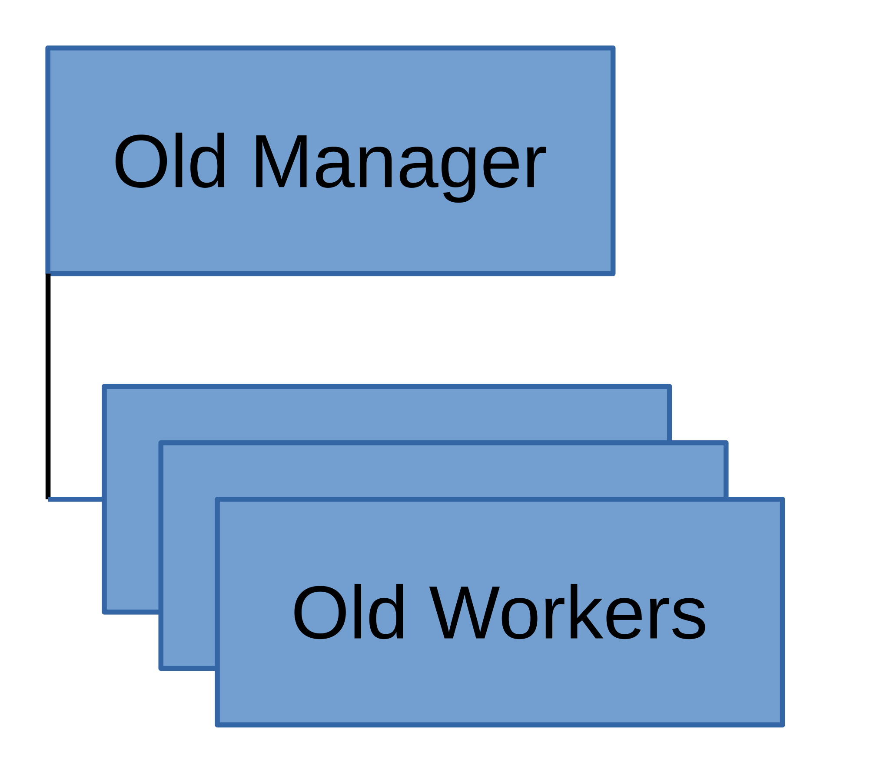
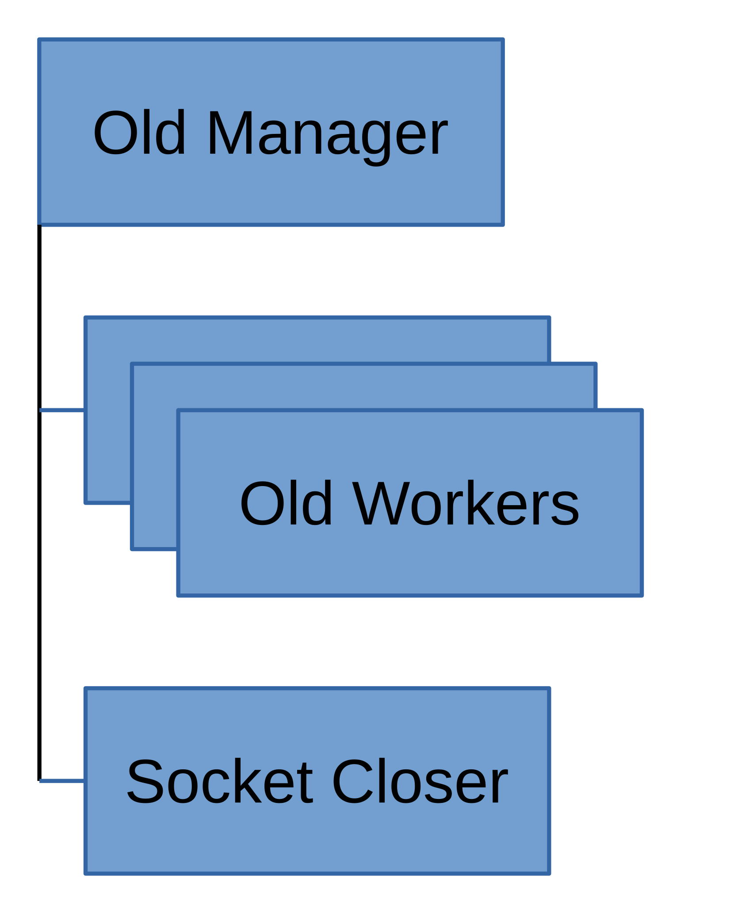
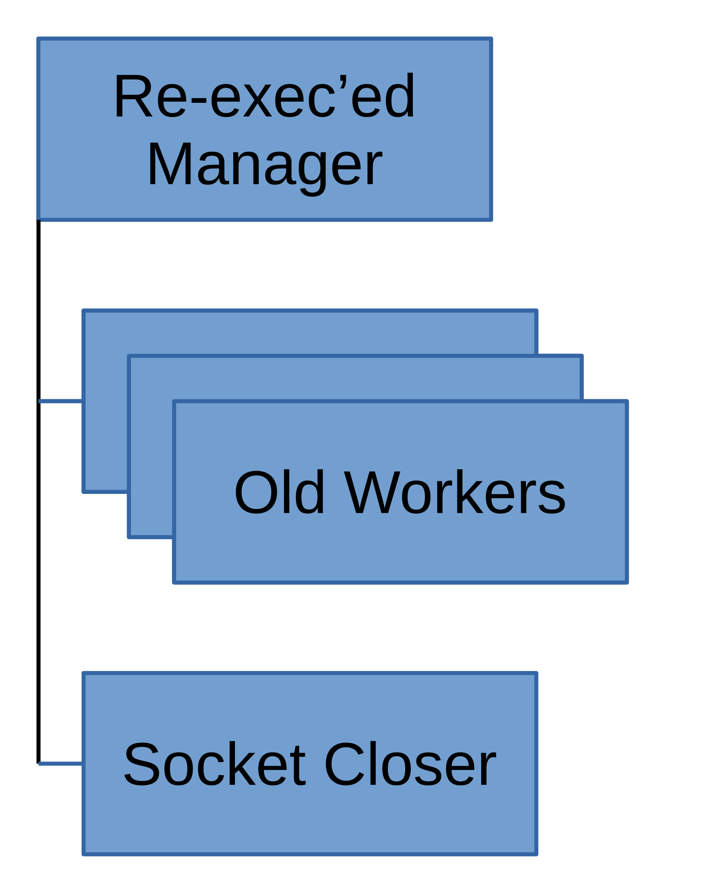
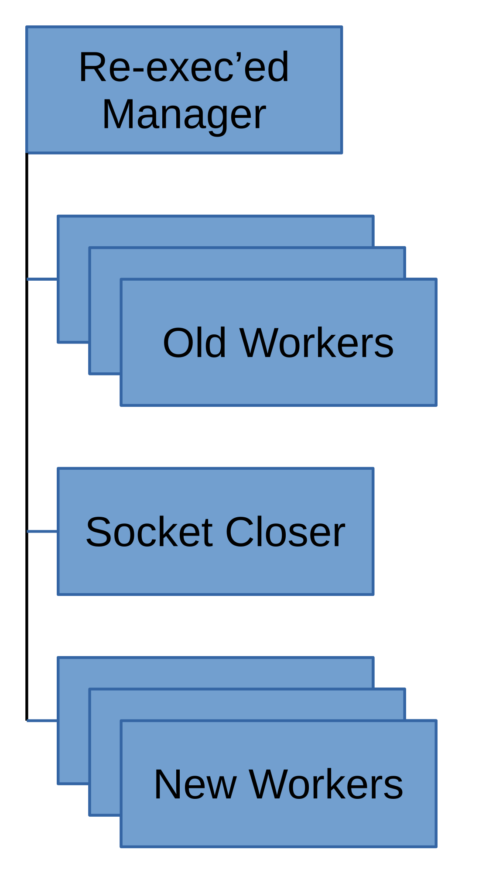
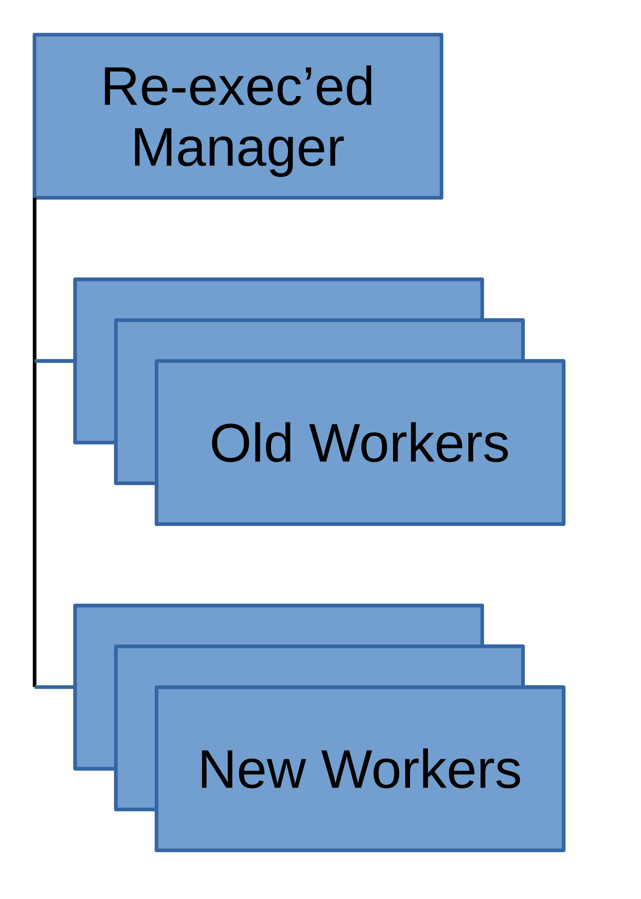
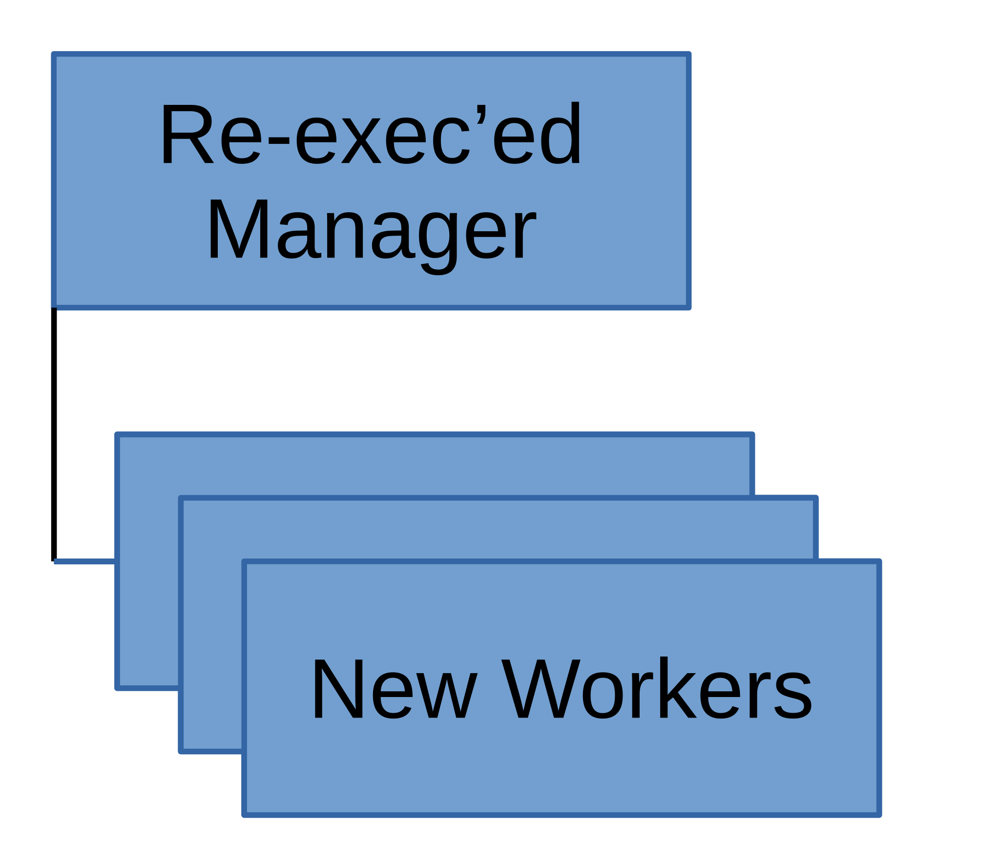

WSGI Server Process Management
==============================

Graceful Shutdowns with ``SIGHUP``
----------------------------------

Swift has always supported graceful WSGI server shutdown via ``SIGHUP``.
This causes the manager process to fall out of its
ensure-all-workers-are-running loop, close all workers' listen sockets,
and exit. Closing the listen sockets causes all new ``accept`` calls to
fail, but does not impact any established connections.

The workers are re-parented, likely to PID 1, and are discoverable with
``swift-orphans``. When the ``accept`` call fails, it waits for the
connection-handling ``GreenPool`` to complete, then exits. Each worker
continues processing the current request, then closes the connection.
Note that clients will get connection errors if they try to re-use a
connection for further requests.

Prior to the introduction of seamless reloads (see below), a common
reload strategy was to perform a graceful shutdown followed by a fresh
service start.

Seamless Reloads with ``SIGUSR1``
---------------------------------

Beginning with Swift 2.24.0, WSGI servers support seamless reloads via
``SIGUSR1``. This allows servers to restart to pick up configuration or
code changes while being minimally-disruptive to clients. The process
is as follows:

1. Manager process receives ``USR1`` signal. This causes the process to fall
   out of its loop ensuring that all workers are running and instead begin
   reloading. The workers continue servicing client requests as long as
   their listen sockets remain open.

2. Manager process forks. The new child knows about all the existing
   workers and their listen sockets; it will be responsible for closing
   the old worker listen sockets so they stop accepting new connections.

3. Manager process re-exec's itself. It picks up new configuration and
   code while maintaining the same PID as the old manager process. At
   this point only the socket-closer is tracking the old workers, but
   everything (including old workers) remains a child of the new manager
   process. As a result, old workers are *not* discoverable with
   ``swift-orphans``; ``swift-oldies`` may be useful, but will also find
   the manager process.

4. New manager process forks off new workers, each with its own listen
   socket. Once all workers have started and can accept new connections,
   the manager notifies the socket-closer via a pipe. The socket-closer
   closes the old worker listen sockets so they stop accepting new
   connections, passes the list of old workers to the new manager,
   then exits.

5. Old workers continue servicing any in-progress connections, while new
   connections are picked up by new workers. Once an old worker completes
   all of its oustanding requests, it exits. Beginning with Swift 2.35.0,
   if any workers persist beyond ``stale_worker_timeout``, the new manager
   will clean them up with ``KILL`` signals.

6. All old workers have now exited. Only new code and configs are in use.

.. note::

   Running without eventlet requires Python >= 3.10: the gunicorn version
   Swift needs (>= 25.2.0) is not available on older interpreters, and
   Swift rejects the mode at startup there. On Python 3.7--3.9, run with
   eventlet.

   The process tree above describes the eventlet WSGI server. When Swift is
   run without eventlet, the WSGI server is gunicorn, which reloads in place:
   a persistent master re-reads the configuration and starts fresh workers
   that rebuild the application pipeline, so configuration, ring, and
   ``swift.conf`` changes take effect. The master does *not* re-exec, so
   changed Python code (a Swift upgrade, edited middleware) is **not** picked
   up by a reload in this mode -- perform a full restart to apply code
   changes. The signals also differ: a seamless reload is ``SIGHUP`` (gunicorn
   reads ``SIGUSR1`` as "reopen logs"). ``swift-init`` and ``swift-reload``
   read each target server's mode from its environment (``USE_EVENTLET``,
   pinned on spawn) and choose the reload strategy and signal accordingly,
   so mixed-mode clusters (e.g. during a migration) can be managed with
   either CLI. A server without the pin -- one started before this Swift,
   the expected first-upgrade state -- is treated as legacy eventlet, so
   its graceful reload semantics are preserved. Only when a target's mode
   is genuinely unknown (its environment is unreadable, or its processes
   disagree) do the CLIs fall back defensively, with a warning: seamless
   reloads still use eventlet's ``USR1`` (harmless on gunicorn), while
   graceful stops use ``SIGTERM``, which stops either mode but skips
   eventlet's graceful drain.

``swift-reload``
----------------

Beginning with Swift 2.33.0, a new ``swift-reload`` helper is included
to help validate the reload process. Given a PID, it will

1. Validate that the PID seems to belong to a Swift WSGI server manager
   process,
2. Check that the config file used by that PID is currently valid,
3. Send the seamless-reload signal for the target's mode (``USR1`` for
   eventlet, ``HUP`` for gunicorn) to initiate a reload, and
4. Wait for the new workers to come up (indicating the reload is complete)
   before exiting.
